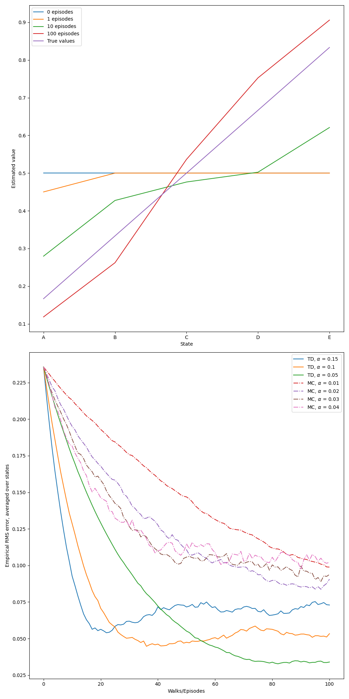
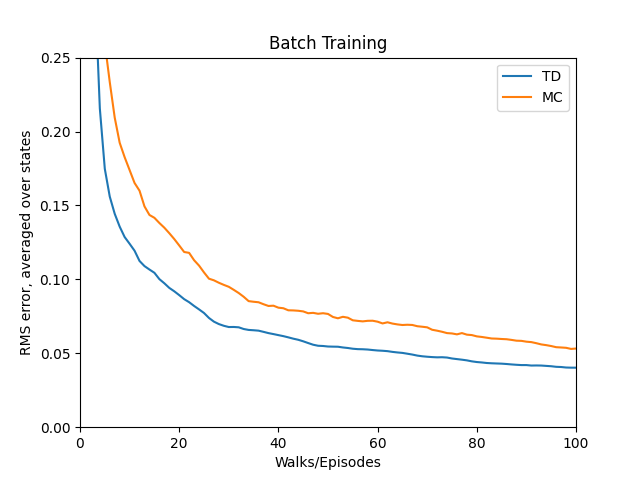

# Random Walk

This project compares **Monte Carlo (MC)** and **Temporal-Difference (TD(0))** learning methods for estimating value functions in a simple **Random Walk** environment. The implementation follows **Example 6.2** from *Reinforcement Learning: An Introduction* by Sutton and Barto.

The primary goal is to analyze:
- How well each method approximates the **true value function**
- The convergence behavior under **batch updating**
- The **bias-variance tradeoff** between MC and TD(0)

---

## Environment Description

The environment is a **linear chain** of seven states:

\[0] - \[A] - \[B] - \[C] - \[D] - \[E] - \[6]

- **States:** Index 0 to 6
- **Start state:** Always begins at state **C** (index 3)
- **Terminal states:** 0 (value = 0) and 6 (value = 1)
- **Transitions:** At each step, the agent randomly moves **left or right** with equal probability
- **Reward:** Only non-zero if the agent terminates at state 6 (reward = 1); otherwise 0

### True Values of Non-Terminal States
These are analytically known:

$$
V(i) = \frac{i}{6}, \quad \text{for } i \in \{1, 2, 3, 4, 5\}
$$

---

## Learning Objectives

The agent attempts to learn an accurate estimate of $V(s)$ for all **non-terminal states** using two learning strategies:

| Learning Method | Characteristics |
|------------------|-----------------|
| **Monte Carlo (MC)** | Uses the return at the end of each episode |
| **TD(0)**            | Bootstraps from next state’s estimate after each step |

---

## Implementation Details

### 1. Monte Carlo (MC)
- Updates occur only **after an episode ends**
- All states in the trajectory receive the **same return**
- More variance, but no bias

**Update rule:**
$$
V(s) \leftarrow V(s) + \alpha \left[G - V(s)\right]
$$

### 2. Temporal-Difference (TD(0))
- Updates occur **at each step**
- Each update uses the current estimate of the next state

**Update rule:**
$$
V(s) \leftarrow V(s) + \alpha \left[R + V(s') - V(s)\right]
$$

### 3. Batch Update Mechanism
- Each method stores all trajectories and rewards
- Value function is updated iteratively using all past data until:
  $$
  \sum_s |\Delta V(s)| < \theta
  $$

---

## Parameters

| Parameter                 | Value      |
|---------------------------|------------|
| Step-size ($\alpha$)      | 0.001 (batch) |
| Convergence threshold ($\theta$) | $10^{-3}$ |
| Episodes per run          | 100        |
| Independent runs          | 100        |

---

Certainly! Here's a **shorter**, **well-structured**, and **clear** version of the **Results** section using headings, bullet points, and tables for better readability—perfect for a README.

---

## Results and  Insights

### Value Estimate Progression (TD(0))

This plot shows how **TD(0)** value estimates evolve over time (0, 1, 10, 100 episodes).

| Observation              | Insight                             |
| ------------------------ | ----------------------------------- |
| Initial estimates at 0.5 | All non-terminal states start equal |
| Gradual convergence      | Estimates approach true values      |
| After 100 episodes       | Close to analytical values          |

---

### RMSE Comparison (TD(0) vs. MC)

This plot compares **Root Mean Square Error (RMSE)** over episodes during **batch training**.

| Aspect                 | TD(0)                     | Monte Carlo (MC)            |
| ---------------------- | ------------------------- | --------------------------- |
| Convergence Speed      | Faster                    | Slower                      |
| Sample Efficiency      | Higher (updates per step) | Lower (updates per episode) |
| Variance               | Lower                     | Higher                      |
| Early Episode Behavior | More stable               | Less stable                 |
| Final RMSE             | Lower                     | Higher                      |

---

### Summary

| Key Advantage of TD(0)          |
| ------------------------------- |
| Learns online and incrementally |
| Requires no environment model   |
| More sample-efficient           |
| Lower RMSE in fewer episodes    |

---

**Conclusion:**
- TD(0) outperforms Monte Carlo in both **learning speed** and **stability**, especially in early training. This makes it a preferred method for value prediction in stochastic environments.
- **Monte Carlo**, while unbiased, suffers from higher variance and slower learning in this task.
- The choice between MC and TD depends on the tradeoff between **variance** and **bias**, and the nature of the environment.
