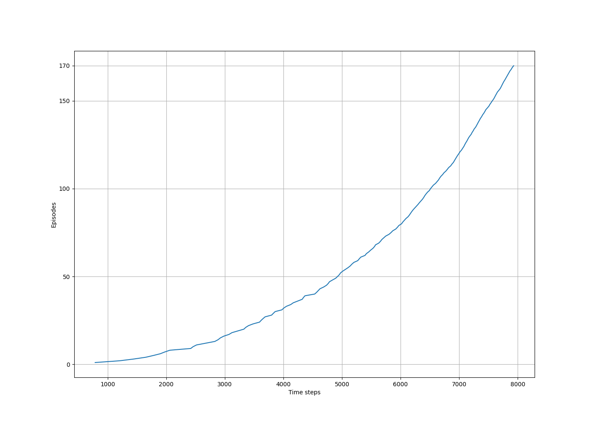

# **Windy Gridworld – SARSA Algorithm Implementation**

This project implements the **SARSA (State-Action-Reward-State-Action)** algorithm to solve the **Windy Gridworld** task, based on Example 6.5 from *Reinforcement Learning: An Introduction* by Sutton and Barto. The task demonstrates how reinforcement learning algorithms handle environments with deterministic external disturbances, specifically wind forces that affect state transitions.

---

## **Environment Specifications**

| Parameter          | Value                           |
| ------------------ | ------------------------------- |
| Grid Size          | 7 rows × 10 columns             |
| Start State        | (3, 0)                          |
| Goal State         | (3, 7)                          |
| Actions            | {↑, ↓, ←, →}                    |
| Wind Strength      | \[0, 0, 0, 1, 1, 1, 2, 2, 1, 0] |
| Reward per Step    | -1                              |
| Discount Factor γ  | 1.0                             |
| Exploration Rate ε | 0.1 (ε-greedy policy)           |
| Learning Rate α    | 0.5                             |

**Wind Dynamics**

* Columns 3, 4, 5: Wind pushes the agent up by 1 cell.
* Columns 6, 7: Wind pushes the agent up by 2 cells.
* Column 8: Wind pushes the agent up by 1 cell.

---

## **Algorithm Description**

The implemented algorithm is the **SARSA control method**, which updates action-value estimates using the following update rule:

$$
Q(S_t, A_t) \leftarrow Q(S_t, A_t) + \alpha \left[ R_{t+1} + \gamma Q(S_{t+1}, A_{t+1}) - Q(S_t, A_t) \right]
$$

* **Policy**: ε-greedy, balancing exploration and exploitation.
* **Exploration**: With probability ε, a random action is selected; otherwise, the greedy action is chosen.
* **Termination Condition**: Each episode ends when the agent reaches the goal state.

---

## **Implementation Details**

| Component                | Description                                                        |
| ------------------------ | ------------------------------------------------------------------ |
| `windy_grid_world.py`    | Contains the environment setup and SARSA algorithm implementation. |
| `windy_grid_world.ipynb` | Jupyter Notebook for running experiments and visualizing results.  |
| `generated_images/`      | Contains generated plots and experiment outputs.                   |
| `book_images/`           | Reference figures from Sutton and Barto’s textbook.                |

---

## **Experimental Results**

###  **Learning Curve – Time Steps per Episode**

* Initially, episodes require a large number of time steps due to exploration.
* With more episodes, the agent discovers shorter, more efficient paths.
* The learning curve confirms the gradual policy improvement expected from SARSA.

---

###  **Learned Policy Visualization**

* The agent learns to avoid columns with strong wind by navigating horizontally before approaching the goal.
* This strategy minimizes upward drift caused by wind and leads to faster episode completion.
* The final learned policy closely matches the optimal policy presented in Sutton and Barto.

---

## **Conclusion**

* The SARSA algorithm successfully learns an optimal policy under deterministic environmental disturbances caused by wind.
* On-policy learning ensures stable value estimates, and ε-greedy exploration prevents the agent from converging prematurely to suboptimal paths.
* Experimental results are consistent with theoretical expectations and the reference textbook.

