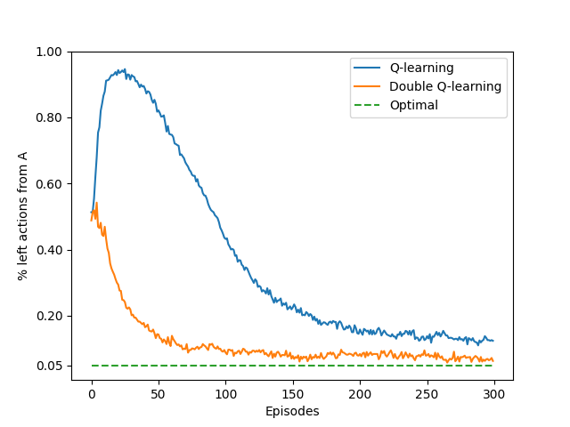

# **Maximization Bias in Action–Value Methods**

This project demonstrates **maximization bias** in value-based RL and how **Double Learning** mitigates it. We implement **Q-Learning**, **Expected SARSA**, and their **Double** variants in a minimal two-state MDP. The setting mirrors *Reinforcement Learning: An Introduction* (Sutton & Barto, Ch. 6 — “Maximization Bias and Double Learning”): noisy action-value estimates at a branching state cause classic max operators to overestimate and prefer a suboptimal branch.

---

## **Environment Specifications**

| Component             | Details                                                                            |
| --------------------- | ---------------------------------------------------------------------------------- |
| **States (S)**        | A, B, terminal                                                                     |
| **Start state**       | A                                                                                  |
| **Actions at A**      | `right` → terminal, reward 0; `left` → B                                           |
| **Actions at B**      | `k` discrete actions (e.g., 10); all transition to terminal                        |
| **Reward at A**       | Always **0** (regardless of action)                                                |
| **Reward at B**       | i.i.d. draw from Normal distribution **𝒩(μ = −0.1, σ² = 1.0)** for *every* action |
| **True optimal at A** | **right** (value 0) vs. **left** (expected < 0) → optimal policy avoids B          |

**Intuition.** Because B’s returns are noisy, the **max** over many sample-based estimates at B becomes systematically **optimistic**. Classic Q-Learning thus tends to prefer **left** at A (suboptimal), illustrating **maximization bias**.

---

## **Parameters**

| Parameter                  | Value (typical) |
| -------------------------- | --------------- |
| Exploration rate (ε)       | 0.1             |
| Step-size (α)              | 0.1             |
| Discount (γ)               | 1.0             |
| Actions at B (k)           | 10              |
| Episodes / runs (notebook) | configurable    |

---

## **Algorithms Implemented**

1. **Q-Learning (off-policy, max target)**
   Update at ⟨s, a⟩ with reward ( R ) and next state ( s' ):

$$
Q(s,a) \leftarrow Q(s,a) + \alpha \Big[ R + \gamma \max_{a'} Q(s',a') - Q(s,a) \Big]
$$

2. **Double Q-Learning (decoupled select–evaluate)**
   Maintain $( Q_1, Q_2 )$. On each step, flip a coin to pick which to update:

   * **Select** $ a^* = \arg\max_{a'} Q_1(s',a') $
   * **Evaluate** with the other table: $ \text{target} = R + \gamma, Q_2(s', a^*) $
     (and vice versa when updating $ Q_2 $ ).
     This breaks the optimistic coupling that causes overestimation.

3. **Expected SARSA (policy expectation target)**
   Uses the **ε-greedy** action distribution at ( s' ):
$$
Q(s,a) \leftarrow Q(s,a) + \alpha \Big[ R + \gamma, \mathbb{E}*{a'\sim\pi*\epsilon(\cdot|s')} Q(s',a') - Q(s,a) \Big]
$$

4. **Double Expected SARSA**
   Same expectation idea, but selection uses ( Q_1 + Q_2 ) (or another symmetric scheme) and evaluation uses the alternate estimate to reduce bias.

**Policy:** ε-greedy over current estimates; ties broken uniformly at random.

---

## **What We Measure**

* **Left-action frequency at A** (how often the suboptimal branch is chosen).

  * High left-frequency ⇒ stronger maximization bias.
  * Double variants should reduce this frequency toward the unbiased baseline.

---

## **Results & Insights**

### **Suboptimal “Left” Choice Rate at State A**

* **Q-Learning**: Shows a **strong preference** for **left** at A due to overestimation from the max over many noisy actions at B.
* **Expected SARSA**: Some mitigation via expectation, but **still biased** when estimates are noisy.
* **Double Q-Learning / Double Expected SARSA**: **Substantially reduce** the left-choice rate, often approaching near-unbiased behavior.

---

### **Overestimation Analysis (B-state)**

* As **k** (number of actions at B) increases, the **max of noisy estimates** grows more optimistic.
* Double methods largely **decouple selection from evaluation**, flattening this growth.

---

## **Project Structure**

| File / Notebook           | Description                                                                                                                                                            |
| ------------------------- | ---------------------------------------------------------------------------------------------------------------------------------------------------------------------- |
| `maximization_bias.py`    | Environment, ε-greedy policy, and implementations of **Q-Learning**, **Double Q-Learning**, **Expected SARSA**, **Double Expected SARSA**; counts “left” actions at A. |
| `maximization_bias.ipynb` | Experiments: sweep episodes/runs and **plot left-action rate** and **overestimation curves**.                                                                          |
| `generated_images/`       | Saved plots (e.g., `max_bias_left_rate.png`, `max_bias_b_overestimate.png`).                                                                                           |

---

## **Reproduction Notes**

* Control RNG seeds per run to compare methods fairly.
* Vary **k** (actions at B) to stress-test maximization bias.
* Compare left-choice rates across methods as episodes increase.
* Sensitivity: ε and α affect exploration and stability; trends remain.

---

## **Conclusions**

* **Maximization bias** is a structural artifact of the **max operator** over noisy estimates; it grows with action count and variance.
* **Double Learning** (for both Q-Learning and Expected SARSA) **significantly reduces** overestimation by decoupling **action selection** from **value evaluation**.
* Even in a tiny MDP, the bias can **flip decisions** at the branching state; robust methods matter.

---

## **References**

* Sutton, R. S., & Barto, A. G. *Reinforcement Learning: An Introduction*, 2nd ed., Chapter 6 (Maximization Bias; Double Learning).
