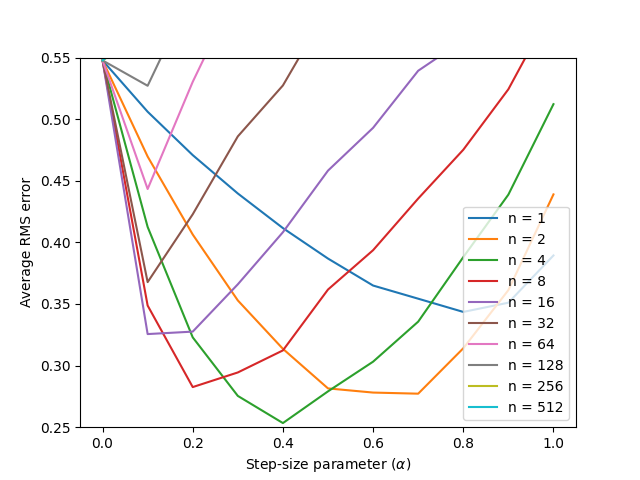

# **Random Walk – n-Step Temporal-Difference Learning (TD(n))**

This project implements **n-step Temporal-Difference (TD(n))** prediction in the classic **19-state Random Walk** from *Reinforcement Learning: An Introduction* (Sutton & Barto, Ch. 7). It compares how different **n** values affect convergence toward the true value function under episodic rollouts with symmetric left/right transitions.

---

## **Environment Specifications**

| Component        | Details                                                                                         |
|------------------|-------------------------------------------------------------------------------------------------|
| **States**       | Linear chain with **21** states: terminals at indices **0** and **20**, non-terminals **1…19** |
| **Start state**  | **10** (center)                                                                                 |
| **Transitions**  | At each step, move **left** or **right** with probability 0.5                                   |
| **Rewards**      | **−1** on entering left terminal (0); **+1** on entering right terminal (20); **0** otherwise   |
| **Discount**     | $\gamma = 1.0$ (undiscounted episodic task)                                                     |
| **True values**  | For non-terminals $i\in\{1,\dots,19\}$: $V(i)=\frac{i-10}{10}$. Terminals have value $0$.       |

---

## **Algorithm: n-Step TD (Prediction)**

Given a trajectory $(s_0, a_0, r_1, s_1, \dots)$, for each update time $t$ define the **n-step return**:

$$
G_{t:t+n} \;=\; \sum_{k=1}^{n} \gamma^{k-1} r_{t+k} \;+\; \gamma^{n}\, V(s_{t+n}).
$$

The **TD(n) update** for a non-terminal state $s_t$ is:

$$
V(s_t) \leftarrow V(s_t) + \alpha \left[\, G_{t:t+n} - V(s_t) \,\right].
$$

- Episodes proceed until reaching a terminal state.  
- For terminal time $T$, the bootstrap term $V(s_{t+n})$ is omitted whenever $t+n \ge T$.  
- This implementation updates **online during the episode** once $t-n \ge 0$.

---

## **Parameters**

| Parameter                    | Typical Values |
|-----------------------------|----------------|
| Step-size $\alpha$          | 0.05 – 0.2     |
| n-step horizon $n$          | 1, 2, 4, 8, 16 |
| Discount $\gamma$           | 1.0            |
| Episodes per run            | 10 – 100       |
| Independent runs (averaging)| 100+           |

---

## **Results & Insights**

### **Value Estimate Progression (TD(n))**

Value progression vs true values

- Early in training, estimates are biased toward 0.5 (uninformed).  
- **Larger $n$** typically reduces bias but can increase variance; **smaller $n$** learns faster with stronger bootstrapping.  
- After ~100 episodes, curves approach the **analytic line** $V(i)=\frac{i-10}{10}$.

---

### **RMSE vs Episodes ($n = 1, 2, 4, 8, 16$)**

| Observation                       | Insight                                                                   |
|-----------------------------------|---------------------------------------------------------------------------|
| **$n = 1$ (TD(0))** learns quickly | Strong bootstrapping → fast initial error drop, slightly higher bias       |
| **Intermediate $n$ (2–4)**        | Good balance of bias/variance → consistently low RMSE                      |
| **Large $n$ (8–16)**              | Lower bias asymptotically, but higher variance and slower early learning   |

---

## **Implementation Details**

- **Episode generation:** start at state 10; step left/right with $p=0.5$; terminate at 0 or 20 with rewards $-1$/$+1$.  
- **Online TD(n):** stores visited states and rewards, computes $G_{t:t+n}$ once enough steps have elapsed, and updates $V$ in-place.  
- **Truth baseline:** vector of analytic values used for RMSE tracking and plots.

---

## **Project Structure**

| File / Notebook     | Description                                                                                     |
|---------------------|-------------------------------------------------------------------------------------------------|
| `random_walk.py`    | Core **TD(n)** implementation, environment dynamics, and utilities (episode rollouts, updates). |
| `random_walk.ipynb` | Experiments: sweep $n$, $\alpha$, and episodes; plot **value curves** and **RMSE**.            |
| `generated_images/` | Saved figures (e.g., `tdn_value_progression.png`, `tdn_rmse_comparison.png`).                   |

---

## **Reproduction Notes**

- Fix RNG seeds per run to obtain stable averages.  
- Report **RMSE vs episodes** averaged over many runs (e.g., 100) for each $n$.  
- Compare learned $V$ to the analytic baseline $V(i)=\frac{i-10}{10}$.  
- Sensitivity: try $\alpha \in \{0.05, 0.1, 0.2\}$ and $n \in \{1,2,4,8,16\}$.

---

## **Conclusions**

- **TD(0)** ($n=1$) is **sample-efficient** early on, thanks to strong bootstrapping.  
- **Intermediate $n$** (≈2–4) often yields the **best RMSE** trade-off in this task.  
- Very **large $n$** behaves more like Monte Carlo: lower bias asymptotically but **higher variance** and slower initial learning.

---

## **References**

- Sutton, R. S., & Barto, A. G. *Reinforcement Learning: An Introduction*, 2nd ed., Chapter 7 (n-step bootstrapping; Random Walk).
