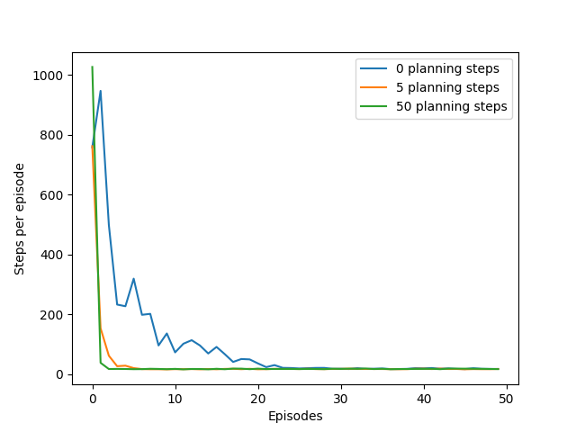
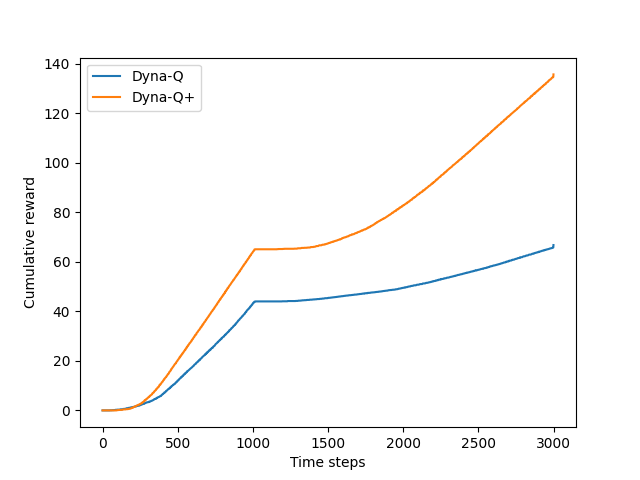
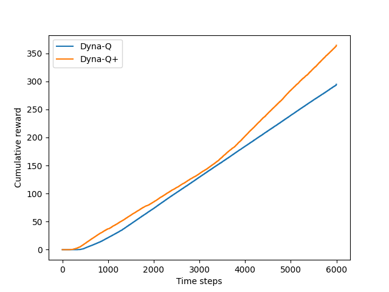
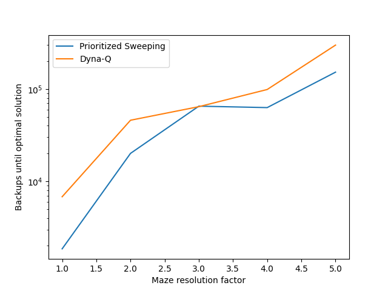

# **Model-Based RL in Mazes — Dyna-Q, Dyna-Q+, and Prioritized Sweeping**

This project studies **planning with learned models** in maze navigation, reproducing three Sutton & Barto–style experiments:

1. **Dyna-Q vs Dyna-Q+** in a stationary maze,
2. **Changing Maze** with altered obstacles and a time-aware model (reward bonus),
3. **Prioritized Sweeping** with a learned predecessor graph and a priority queue.

We compare **sample updates** (real experience) against **planning updates** (simulated from a model), and examine how **exploration bonuses** and **sweep order** impact efficiency and adaptability.

---

## **Environment (Maze)**

| Component            | Details                                           |
| -------------------- | ------------------------------------------------- |
| **Grid size**        | Default **9 × 6**                                 |
| **Start**            | [2, 0]                                            |
| **Goal(s)**          | [[0, 8]]                                          |
| **Actions**          | {up=0, down=1, left=2, right=3}                   |
| **Obstacles (base)** | [[1,2], [2,2], [3,2], [0,7], [1,7], [2,7], [4,5]] |
| **Reward**           | +1 on entering a goal; 0 otherwise                |
| **Dynamics**         | Deterministic grid moves; blocked by obstacles    |
| **Resolution**       | Optional upscaling by factor *r* (state tiling)   |

---

## **Algorithms**

### **Dyna-Q (learning + planning)**

At each step: act with ε-greedy, update **Q** by **Q-Learning**, then **plan** for `planning_steps` samples from a learned model:

$$
Q(s,a) \leftarrow Q(s,a) + \alpha \Big[\, r + \gamma \max_{a'} Q(s',a') - Q(s,a) \,\Big]
$$

### **Dyna-Q+ (time-aware model bonus)**

Same as Dyna-Q, but the model adds an **exploration bonus** that grows with time since a state–action was last tried:

$$
\tilde{r} \;=\; r \;+\; \kappa \sqrt{\,t_{\text{now}} - t_{\text{last}}\,}
$$

Also inserts untried actions as timestamped self-loops so planning considers them.

### **Changing Maze (non-stationary)**

Mid-run the obstacle layout switches from `old_obstacles` to `new_obstacles`, testing **adaptation**.

### **Prioritized Sweeping (PS)**

Maintains a **predecessor graph** and a **priority queue**. Each real step computes priority

$$
p(s,a) \;=\; \Big|\, r + \gamma \max_{a'} Q(s',a') - Q(s,a) \,\Big|
$$

and repeatedly backs up the **largest-priority** pairs, then enqueues affected predecessors.

---

## **Parameters**

| Parameter            | Meaning                      | Typical            |
|---------------------:|------------------------------|--------------------|
| $\gamma$             | Discount                     | 0.95               |
| $\epsilon$           | ε-greedy exploration         | 0.1                |
| $\alpha$             | Step-size                    | 0.1                |
| $n_{\text{plan}}$    | Planning steps per real step | 5                  |
| $\kappa$             | Time-bonus weight (Dyna-Q+)  | $1\times 10^{-4}$  |
| $\theta$             | PS priority threshold        | 0 (include all)    |
| Runs                 | Independent averages         | 10                 |

---

## **Results & Insights**

### **Learning with Planning (Stationary Maze)**

- More **planning steps** sharply reduces **steps per episode**; 5–50 planning backups already converge near-optimally within a few episodes.

---

### **Adaptation After Obstacle Change (Short Horizon)**

- After the obstacle switch, **Dyna-Q+** (time bonus) **recovers faster**, promoting re-exploration of stale actions.

---

### **Adaptation After Obstacle Change (Longer Run)**

- Over longer horizons, **Dyna-Q+** consistently accumulates more reward than plain Dyna-Q.

---

### **Computation Focus: Prioritized Sweeping vs Dyna-Q**

- With the **same resolution scaling**, **PS** reaches an optimal solution with **fewer total backups** than uniform Dyna-Q planning—especially at lower resolutions—by focusing updates where Bellman error is largest.

---

## **Implementation Details**

- **`Maze`**: grid dynamics, obstacle switching, and optional **resolution upscaling**.  
- **Action selection**: ε-greedy over $Q(s,\cdot)$; uniform tie-breaking.  
- **Models for planning**:
  - *Tabular Dyna-Q* storing last $(s,a)\to(s',r)$ samples,
  - *Time-aware Dyna-Q+* with timestamps + $\kappa\sqrt{\Delta t}$ bonus,
  - *PS model* with predecessor tracking and a binary-heap priority queue.
- **Core loops**: `dyna_q(...)`, `changing_maze(...)`, `prioritized_sweeping(...)`.  
- **Metrics**: steps per episode, cumulative reward, and **backups until optimality**.

---

## **Project Structure**

| File / Notebook              | Description                                                                                                  |
| ---------------------------- | ------------------------------------------------------------------------------------------------------------ |
| `maze.py`                    | Gridworld wrapper (size, start/goal, obstacles, `step`, resolution).                                        |
| `models.py`                  | Planning models: tabular, time-aware (Dyna-Q+), and prioritized-sweeping with predecessors.                 |
| `functions.py`               | Training utilities: ε-greedy `choose_action`, `dyna_q`, `changing_maze`, `prioritized_sweeping`, path check.|
| `dyna.py`                    | `DynaParams` container ($\gamma$, $\epsilon$, $\alpha$, $\kappa$, planning steps, threshold, runs).         |
| `dyna_maze.ipynb`            | Part I experiments (planning steps vs learning speed).                                                       |
| `changing_maze.ipynb`        | Part II experiments (obstacle switch & recovery).                                                            |
| `prioritized_sweeping.ipynb` | Part III experiments (PS vs Dyna-Q at matched backup budgets).                                               |
| `generated_images/`          | Figures: `figure_8_2.png`, `figure_8_4.png`, `figure_8_5.png`, `example_8_4.png`.                           |

---

## **Conclusions**

- **Planning** dramatically improves **sample efficiency** over pure TD control.  
- The **time-aware bonus** in **Dyna-Q+** boosts **re-exploration** and accelerates recovery in **non-stationary** mazes.  
- **Prioritized Sweeping** focuses computation on large Bellman errors, achieving optimal solutions with **fewer backups**, especially at lower resolutions.

---

## **References**

- Sutton, R. S., & Barto, A. G. *Reinforcement Learning: An Introduction*, 2nd ed. (Dyna, Dyna-Q+, Prioritized Sweeping).
