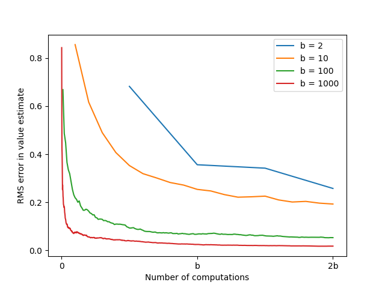

# **Expectation vs. Sample Updates — Computation Trade-offs with Branching Factor (b)**

This project illustrates why **expectation backups** (model-based) can outperform **sample backups** (model-free sampling) when the **branching factor (b)** is large. We reproduce the qualitative behavior from Sutton & Barto (Ch. 8): estimating a state value by (i) **sampling one successor per computation** vs. (ii) **computing the expectation over all (b) successors**. For a fixed computation budget (up to (2b) primitive operations), expectation updates reduce error **much faster** as (b) grows.

---

## **Problem Setup**

| Component            | Description                                                    |
| -------------------- |----------------------------------------------------------------|
| **State**            | One state with (b) possible next outcomes (successors).        |
| **Successor values** | Drawn i.i.d. from a fixed distribution (here, a Normal).       |
| **True value**       | $v^* = \mathbb{E}[X]$, the mean of the successor distribution. |
| **Goal**             | Track the **estimation error** as computations increase.       |
| **Budget**           | Up to (2b) primitive computations per curve.                   |

---

## **Two Update Styles**

### **1) Sample backup (model-free flavor)**

* Each primitive computation draws **one sample** (X_t) from the successor distribution and updates the running mean:
  \
  \hat v_t \leftarrow \frac{1}{t}\sum_{i=1}^{t} X_i
  \

* After (t) computations you have (t) samples.

### **2) Expectation backup (model-based flavor)**

* **One expectation backup ≈ (b) primitive computations** (to average all successors once):
  $$
  \tilde v ;=; \frac{1}{b}\sum_{j=1}^{b} X_j
  $$
* With the same total budget $\le 2b$, you can afford at most **two expectation evaluations**, but each has **near-zero variance** relative to single-sample draws.

**Intuition.** When (b) is large, spending computations to average many successors (expectation) reduces variance dramatically compared to building the average from one-at-a-time samples.

---

## **Parameters**
| Symbol | Meaning                         | Values used                |
|:-----:|---------------------------------|----------------------------|
| \(b\) | Branching factor (successors)   | $ (\{2, 10, 100, 1000\}\ $ |
| Steps | Primitive computations (x-axis) | $ (0 \ldots 2b) $          |
| Metric| Error curve                     | $\text{RMS}( \hat v - v^* )$ over repeated trial |

---

## **Results & Insights**

* **Small (b)** (e.g., 2, 10): Sample and expectation have comparable efficiency; both drop error rapidly.
* **Large (b)** (100, 1000): **Expectation updates dominate**—a single or couple of expectation evaluations (costing (b) each) push the error close to zero, while sample-only updates need many more computations to match the same accuracy.
* **Takeaway:** When a **model** is available and (b) is large, **planning with expectations** can yield **orders-of-magnitude** better accuracy per unit computation.

---

## **Implementation Details**

* The experiment draws a fresh set of (b) successor values from a Normal distribution and treats their average as the **ground truth** $v^*$.
* **Sample curve:** incrementally samples successors (with replacement), tracks the running mean, and logs absolute error vs. computation count.
* **Expectation points:** compute the full mean after (b) and (2b) primitive operations to show how quickly error collapses.
* Repeating across multiple trials smooths the **RMS error** curves.
* Files:

  * `expectation_vs_sample.py` — core logic to generate the error trajectories for a given (b).
  * `expectation_vs_sample.ipynb` — runs sweeps over (b), aggregates trials, and plots the figure.
  * `generated_images/figure_8_7.png` — produced plot.

---

## **Project Structure**

| File / Notebook               | Description                                                                      |
| ----------------------------- | -------------------------------------------------------------------------------- |
| `expectation_vs_sample.py`    | Functions to simulate sample-vs-expectation estimation and collect error curves. |
| `expectation_vs_sample.ipynb` | Experiment driver: loops over (b), aggregates runs, renders `figure_8_7.png`.    |
| `generated_images/`           | Output figures (`figure_8_7.png`).                                               |

---

## **Conclusions**

* **Expectation backups** amortize computation across many successors and **crush variance** when (b) is large.
* **Sample backups** are flexible and model-free, but for a fixed compute budget they converge more slowly on high-branching problems.
* In planning-capable settings with large (b), **do the expectation**; in model-free or low-branching settings, sampling can be competitive.

---

## **References**

* Sutton, R. S., & Barto, A. G. *Reinforcement Learning: An Introduction*, 2nd ed., Ch. 8 (Planning and acting; expectation vs sampling).
