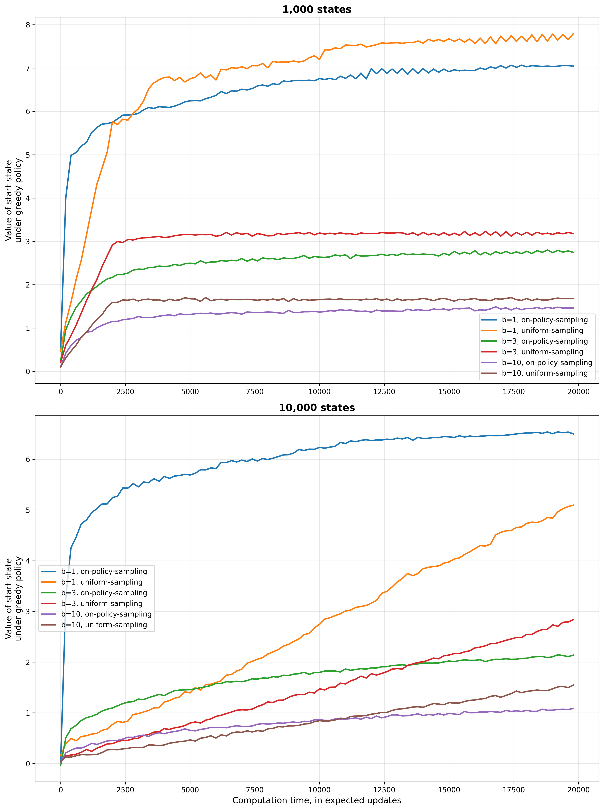

# **Trajectory Sampling vs. Uniform Expected Updates**

This project compares **on-policy trajectory sampling** against **uniform expected updates** in large random MDPs. Following Sutton & Barto (Ch. 8), we measure how well each planning distribution improves the **value of the start state under the greedy policy** as computation time (in expected updates) increases.

---

## **Problem Setup**

| Component                | Details                                                                                                            |
|--------------------------|--------------------------------------------------------------------------------------------------------------------|
| **States**               | Large random MDPs with **1,000** and **10,000** non-terminal states                                                |
| **Actions**              | 2 actions per state                                                                                                |
| **Branching factor $b$** | Number of possible next states sampled per state–action                                                            |
| **Transitions/Rewards**  | For each state–action, next states are drawn uniformly from the state set; rewards are i.i.d. $\mathcal{N}(0,1)$   |
| **Termination**          | Each transition terminates with probability $0.1$ and yields $0$ reward                                            |
| **Objective**            | Maximize the start-state value under the greedy policy induced by current estimates                                |

The environment and experiment driver construct many independent random tasks and average results to smooth curves.

---

## **Update Distributions**

### **On-policy trajectory sampling**

Simulates a single agent run using $\epsilon$-greedy over current $Q$ and updates the visited **state–action** via an **expected backup** over its $b$ successors (model known). The backup distribution concentrates on states encountered by the current policy, naturally emphasizing **relevant regions** of the state space.

### **Uniform expected updates**

Sweeps state–actions in a **uniform** round-robin fashion and performs expected backups for each, distributing computation **evenly** over the entire space regardless of the current policy.

Both methods use tabular action-value estimates and greedy evaluation of the start state via Monte Carlo rollouts under the induced greedy policy.

---

## **Parameters**

| Parameter                | Value / Range                             |
|--------------------------|-------------------------------------------|
| Discount $\gamma$        | 1.0                                       |
| Termination prob.        | 0.1                                       |
| Exploration $\epsilon$   | 0.1                                       |
| Branching $b$            | $\{1,3,10\}$                              |
| Max compute budget       | 20,000 expected updates                   |
| Tasks averaged           | 30 per setting                            |
| Eval metric              | Greedy start-state value vs. compute time |

---

## **Results & Insights**

**Top (1,000 states).**

- **On-policy sampling** rises quickly and attains **higher values** for $b=1$ and $b=3$, reflecting its focus on states the greedy policy actually visits.
- For **uniform**, progress is steadier but tops out **lower**, especially as $b$ increases.

**Bottom (10,000 states).**

- With many states, **uniform** spreads updates too thin: curves remain low across $b$.
- **On-policy** continues to improve and clearly dominates, particularly at $b=1$.

**Takeaways.**

- When the model is available and the state space is **large**, directing computation **along policy-relevant trajectories** is far more effective than uniform sweeps.
- Larger $b$ increases per-backup cost; on-policy focus helps retain efficiency.

---

## **Implementation Details**

- **Task generator:** builds random transition tensors and reward tables for all state–action pairs; next-state choices and termination events are vectorized and pre-sampled for speed.
- **Backups:** for a visited $(s,a)$, compute
  $$
  Q(s,a) \leftarrow (1 - p_{\text{term}})\,\mathbb{E}\!\left[r + \max_{a'} Q(s',a')\right]
  $$
  by averaging over the $b$ successors.
- **Evaluation:** periodic Monte Carlo estimates of the **greedy** start-state value with episode caps to bound roll-length.
- **Parallelization:** multiple tasks run in parallel and are averaged to produce each curve.

---

## **Project Structure**

| File / Notebook                   | Description                                                                                                                |
| --------------------------------- |----------------------------------------------------------------------------------------------------------------------------|
| `trajectory_sampling.py`          | Core experiment code: random task generator, **on-policy** vs **uniform** expected updates, evaluation, and parallel runs. |
| `trajectory_sampling.ipynb`       | Driver notebook: sweeps over state counts and $b$, aggregates results, and renders figures.                                |
| `generated_images/figure_8_8.png` | Final figure (two panels for 1,000 and 10,000 states).                                                                     |

---

## **Conclusions**

- **On-policy trajectory sampling** focuses computation where it matters, yielding **faster and higher** value improvements in large MDPs.
- **Uniform expected updates** may be preferable only in **small** state spaces or when broad coverage is required irrespective of the current policy.
- For scalable planning with a known model, allocate updates along **likely trajectories** rather than sweeping the entire state–action space uniformly.

---

## **References**

- Sutton, R. S., & Barto, A. G. *Reinforcement Learning: An Introduction*, 2nd ed., Ch. 8 (Planning distributions; trajectory sampling vs uniform updates).
