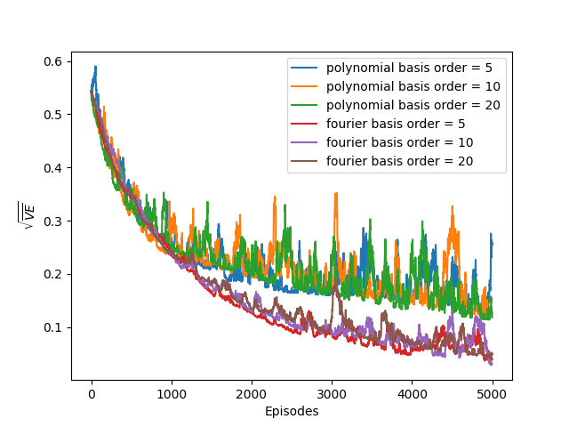
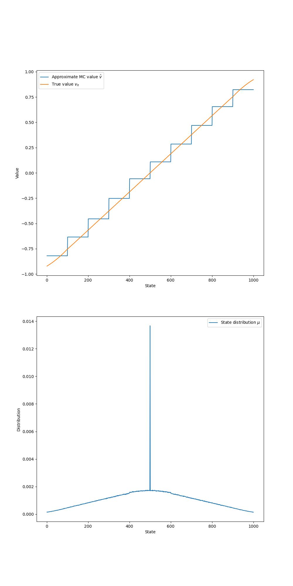
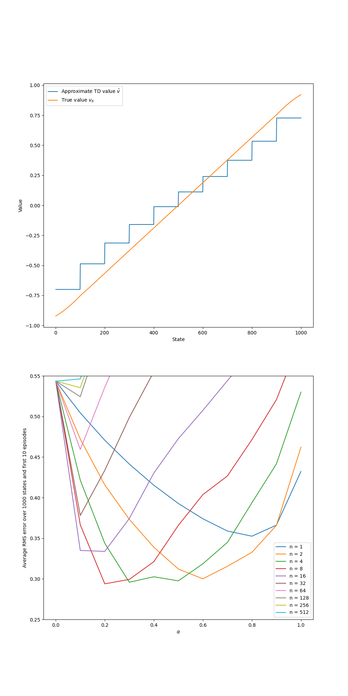

# **Random Walk with Function Approximation — MC, TD($n$), and Representations**

This project explores **value prediction with function approximation** on a large **random-walk** task. We compare **Gradient Monte Carlo**, **semi-gradient TD($n$)**, and several **representations**—state aggregation, **polynomial** bases, **Fourier** bases, and **tile coding**—following the themes of Sutton & Barto (Ch. 9).

---

## **Environment**

| Component       | Details                                                                       |
| --------------- | ----------------------------------------------------------------------------- |
| **States**      | 1,000 non-terminal states indexed $1\ldots 1000$; terminals at $0$ and $1001$ |
| **Start**       | $500$ (center)                                                                |
| **Actions**     | Left ($-1$) or Right ($+1$)                                                   |
| **Stride**      | Random step size $\in{1,\ldots,100}$ multiplied by action sign                |
| **Transitions** | Clipped to $[0,1001]$ (terminals)                                             |
| **Rewards**     | $-1$ on entering state $0$, $+1$ on entering $1001$, else $0$                 |
| **Discount**    | $\gamma=1.0$ (episodic)                                                       |
| **True values** | Computed by iterative DP for evaluation/plots                                 |

---

## **Value Function Representations**

All methods approximate $v(s)$ linearly: $\ \hat v(s)=\mathbf{w}^\top {\phi}(s)$.

1. **State Aggregation**
   Partition the line into $m$ groups; ${\phi}(s)$ is one-hot for the group containing $s$.

2. **Polynomial Bases** (order $n$)
   ${\phi}(s) = [1,\ \tilde s,\ \tilde s^2,\ \ldots,\ \tilde s^{,n}]$, with $\tilde s = s/1000$.

3. **Fourier Bases** (order $n$)
   ${\phi}(s) = [\cos(0\pi \tilde s),\ \cos(1\pi \tilde s),\ \ldots,\ \cos(n\pi \tilde s)]$.

4. **Tile Coding**
   Multiple offset tilings of width `tileWidth`; one active tile per tiling contributes to $\hat v(s)$.

---

## **Algorithms**

* **Gradient Monte Carlo (on-policy prediction)**
  For each visited $s$ in an episode with terminal return $G$,
  $$
  \mathbf{w}\leftarrow \mathbf{w} + \alpha,\big(G - \hat v(s)\big),{\phi}(s).
  $$

* **Semi-gradient TD($n$)**
  Using $n$-step return $G_{t:t+n}=\sum_{k=1}^{n}\gamma^{k-1}r_{t+k}+\gamma^n \hat v(s_{t+n})$ (omit bootstrap past terminal),
  $$
  \mathbf{w}\leftarrow \mathbf{w} + \alpha,\big(G_{t:t+n}-\hat v(s_t)\big),l{\phi}(s_t).
  $$

---

## **Parameters**

| Parameter          | Typical values / notes                               |
| ------------------ | ---------------------------------------------------- |
| Step size $\alpha$ | Representation-dependent (swept in notebooks)        |
| TD horizon $n$     | ${1,2,4,8,16,\ldots}$                                |
| Aggregation groups | e.g., $m\in{10,20,\ldots}$                           |
| Basis order        | Polynomials / Fourier: ${5,10,20}$                   |
| Tile coding        | `numOfTilings`, `tileWidth`, `tilingOffset` (varied) |
| Episodes           | Hundreds to thousands (plots show averages)          |

---

## **Results & Insights**

### 1) **Polynomial vs Fourier Bases**

* Metric is $\sqrt{\overline{\mathrm{VE}}}$ (root mean value error) vs episodes.
* **Fourier** bases consistently achieve **lower error** and smoother learning than equal-order **polynomials**, especially at higher order.

---

### 2) **TD($n$) with State Aggregation**

* **Top:** Learned $\hat v$ (stepwise from aggregation) vs true $v_\pi$.
* **Bottom:** Average RMSE over first 10 episodes vs $\alpha$ for many $n$’s.

  * **Small $n$**: fastest early learning (more bootstrapping) but higher bias.
  * **Intermediate $n$ (2–4)**: best bias–variance trade-off (lowest RMSE region).
  * **Large $n$**: MC-like—lower asymptotic bias, higher variance and narrower stable $\alpha$.

---

### 3) **Gradient MC with State Aggregation**

* **Top:** MC’s $\hat v$ approaches the true line with piecewise plateaus.
* **Bottom:** Empirical visitation distribution $\mu$ over states (spike at start).

  * Highlights that naive averaging can **over-weight** regions frequently visited (e.g., the start).

---

## **Implementation Details**

* `random_walk.py` includes:

  * Environment dynamics (`step`, `get_action`), DP routine for **true values**.
  * **Aggregation**, **Polynomial/Fourier**, and **Tile-coding** value-function classes.
  * **Gradient MC** and **semi-gradient TD($n$)** training loops.
* Notebooks:

  * `state_aggregation.ipynb` — MC vs TD($n$), RMSE vs $\alpha$.
  * `polynomials_vs_fourier.ipynb` — basis orders vs $\sqrt{\overline{\mathrm{VE}}}$.
  * `tile_coding.ipynb` — tilings/width/offset ablations.
  * `bootstrapping.ipynb` — $n$ and stability sweeps.

---

## **Project Structure**

| File / Notebook                | Description                                                  |
| ------------------------------ | ------------------------------------------------------------ |
| `random_walk.py`               | Env, representations, and learning algorithms (MC, TD($n$)). |
| `state_aggregation.ipynb`      | Aggregation experiments (value curves, RMSE vs $\alpha$).    |
| `polynomials_vs_fourier.ipynb` | Basis comparison (orders 5/10/20; polynomial vs Fourier).    |
| `tile_coding.ipynb`            | Tile-coding design sweeps.                                   |
| `bootstrapping.ipynb`          | Bias–variance explorations across $n$.                       |
| `generated_images/`            | `figure_9_5.png`, `figure_9_1.png`, `figure_9_2.png`.        |

---

## **Conclusions**

* **Representation matters:** **Fourier** features learn smoother and more accurately than equal-order **polynomials**.
* **Choice of $n$:** **Intermediate $n$** (≈2–4) often minimizes RMSE by balancing bias and variance.
* **Aggregation/tiles:** Coarser features learn fast but are biased; finer features capture detail but need careful $\alpha$ and more data.

---

## **References**

* Sutton, R. S., & Barto, A. G. *Reinforcement Learning: An Introduction*, 2nd ed., Ch. 9 (Function approximation; gradient methods).
