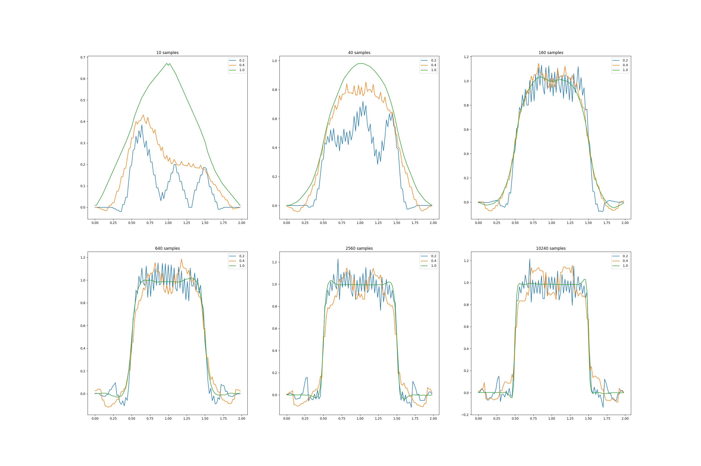

# **Square-Wave Value Approximation with Overlapping Features**

This project studies **supervised value approximation** on a simple **square-wave** target function using **overlapping interval features** (state aggregation / tile-like features). We explore how **feature width** and **sample count** affect approximation quality, following the themes of *Sutton & Barto* (Ch. 9: gradient methods & representations).

---

## **Target Function & Sampling**

| Component       | Details                                                                                |
| --------------- |----------------------------------------------------------------------------------------|
| **Domain**      | Continuous interval $[0, 2)$                                                            |
| **Square wave** | $f(x) = 1$ if $0.5 < x < 1.5$, else $0$                                                |
| **Sampling**    | Draw $x \sim \mathrm{Uniform}[0,2)$; label $y = f(x)$. Repeat for a chosen sample size.|

---

## **Value Function (Feature Representation)**

We use a **bank of overlapping interval features** that partition $[0,2)$. Each feature $i$ is an interval; the value estimate at $x$ is the **sum of weights** of all features that contain $x$:

$$
\hat{v}(x) \;=\; \sum_{i \in \mathcal{A}(x)} w_i .
$$

- Features are created by sliding a window of width **`feature_width`** across the domain to obtain **`num_of_features`** intervals (default 50).
- **Active features** for $x$ are those whose intervals contain $x$.
- **Estimate:** sum of active weights.

**Online update (per sample (x,y))**

$$
\delta \leftarrow y - \hat{v}(x), \qquad
w_i \leftarrow w_i + \frac{\alpha}{\lvert \mathcal{A}(x)\rvert}\,\delta \quad \forall\, i \in \mathcal{A}(x),
$$

with default step-size $\alpha = 0.2$.

---

## **Parameters**

| Parameter            | Meaning                               | Typical values                    |
|----------------------|---------------------------------------|-----------------------------------|
| `feature_width`      | Interval size for each feature window | $\{0.2,\;0.4,\;1.0\}$             |
| `num_of_features`    | Number of features across $[0,2)$     | 50 (default)                      |
| `step_size` $\alpha$ | Per-sample learning rate              | 0.2 (default)                     |
| `samples`            | Number of training samples            | $\{10,\,40,\,160,\,640,\,2560,\,10240\}$ |

---

## **Results & Insights**

- **Data regime matters.** With **10–40 samples**, estimates are underfit and smooth; by **160+ samples** the plateau emerges, and edges sharpen.
- **Feature width controls bias–variance.**
  - Narrow features (e.g., **0.2**) capture edges but show higher variance at low samples.
  - Medium width (**0.4**) balances smoothness and edge fidelity.
  - Wide features (**1.0**) are very smooth—good initially but biased near discontinuities.
- **Saturation with data.** Past **~2k samples**, all widths approach the ideal flat top with sharp drops near 0.5 and 1.5, consistent with the piecewise-constant target.

---

## **Implementation Details**

- **`square_wave.py`** defines the target function and sampling utilities; `approximate(...)` loops through samples and does online weight updates.
- **`classes.py`** provides:
  - `Interval` (containment, size),
  - `DOMAIN = [0,2)`,
  - `ValueFunction` (feature construction, active features, value, update).
- **Training flow:** sample a batch → incremental updates → plot $\hat{v}(x)$ on a fine grid for each **feature width** and **sample size**.

---

## **Project Structure**

| File / Notebook         | Description                                                                           |
|-------------------------|---------------------------------------------------------------------------------------|
| `square_wave.py`        | Square-wave target, random sampling, and the training loop (`approximate`).           |
| `classes.py`            | Interval & ValueFunction classes (windows, weights, value, update).                   |
| `square_wave.ipynb`     | Notebook to vary **feature width** and **samples**, and to render the 6-panel figure. |

---

## **Conclusions**

- **Overlapping interval features** can approximate discontinuous targets well with enough data; **narrower features** capture edges best but need more samples.
- The experiment concretely shows the **bias–variance trade-off** in function approximation: feature width sets inductive bias, while data volume reduces variance.
- This setup is a minimal, transparent sandbox for testing **online gradient-style updates** with coarse-coded features.

---

## **References**

- Sutton, R. S., & Barto, A. G. *Reinforcement Learning: An Introduction*, 2nd ed., Ch. 9 (Gradient methods and function approximation).
