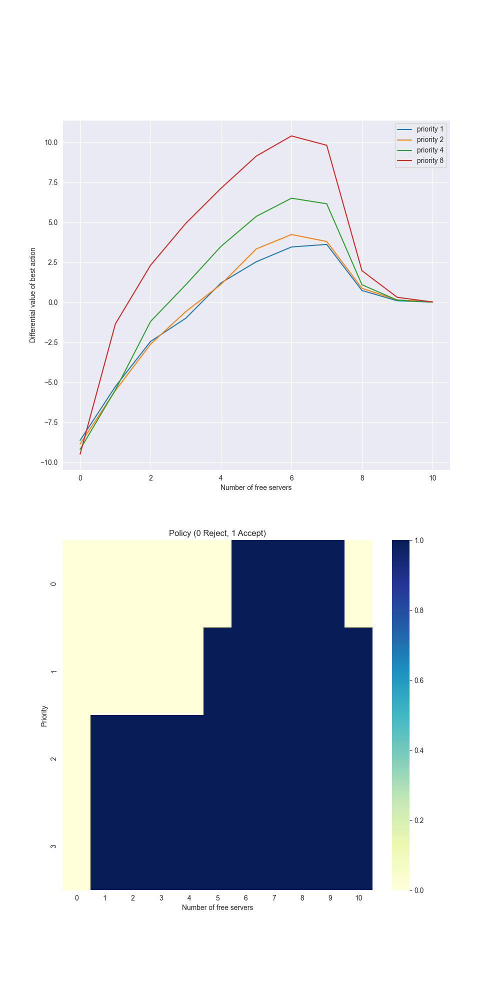

# **Access Control — Average-Reward Differential SARSA with Tile Coding**

This project tackles the classic **access-control queueing task** (Sutton & Barto, Ch. 10). Arriving customers of different priorities compete for a fixed pool of servers. We learn a **continuing, average-reward** control policy using **differential semi-gradient SARSA** with **tile-coded** linear function approximation.

---

## **Environment**

| Component       | Details                                                                                                                         |
| --------------- | ------------------------------------------------------------------------------------------------------------------------------- |
| **State**       | $(f, p)$ where $f\in{0,\dots,10}$ free servers, $p\in{0,1,2,3}$ priority                                                        |
| **Actions**     | ${\text{reject}=0,\ \text{accept}=1}$ (if $f=0$ then only reject)                                                               |
| **Transitions** | If accepted and $f>0$, set $f!\leftarrow! f-1$. After each step, each busy server becomes free independently with prob. $0.06$. |
| **Rewards**     | $2^{p}$ when **accepting** a customer, else $0$                                                                                 |
| **Objective**   | Maximize the **long-run average reward** $\bar r$                                                                               |

---

## **Value Function & Representation**

We approximate action-values with tile coding and a linear function:
$$
\hat q(f,p,a);=;\sum_{i\in\mathcal{A}(f,p,a)} w_i,
$$
where $\mathcal{A}(f,p,a)$ returns the active tiles for $(f,p,a)$ across multiple overlapping tilings (Sutton’s `IHT`/`tiles` scheme).

---

## **Algorithm — Differential Semi-Gradient SARSA**

For a transition $(s,a)\xrightarrow{,r,} (s',a')$ with estimates $\hat q$, running average reward $\bar r$, and step sizes $\alpha,\beta$:
$$
\delta ;=; r ;-; \bar r ;+; \hat q(s',a') ;-; \hat q(s,a),
$$
$$
\bar r \leftarrow \bar r + \beta,\delta,\qquad
w_i \leftarrow w_i + \alpha,\delta\ \ \forall i\in\mathcal{A}(s,a).
$$
Action selection is $\varepsilon$-greedy over $\hat q$.

---

## **Parameters**

| Parameter       | Typical value / note                               |
| --------------- | -------------------------------------------------- |
| Servers         | $10$                                               |
| Freeing prob.   | $0.06$ per busy server per step                    |
| Priorities      | ${0,1,2,3}$ with reward $2^p$                      |
| $\varepsilon$   | $0.1$                                              |
| $\alpha$        | $0.01$ (divide by number of tilings internally)    |
| $\beta$         | $0.01$ (average-reward step size)                  |
| Tile coding     | e.g., $8$ tilings, hash size $2048$ (configurable) |
| Training length | Sufficient steps to reach a stable average reward  |

---

## **Results & Insights**

  

* **Action advantage vs. free servers (top).** For higher priorities the “accept” advantage appears with **fewer** free servers, reflecting larger immediate rewards ($2^p$).
* **Learned policy heatmap (bottom).** Blue cells denote **accept**. The accept region expands monotonically with priority and available servers; with $f=0$ all states are **reject** (feasibility).

---

## **Implementation Details**

* **Tile coding.** Standard `IHT` hash table and `tiles(...)` helpers to create sparse binary features for $(f,p,a)$.
* **Scaling.** Inputs $(f,p)$ are scaled by the number of tilings to distribute activation evenly.
* **Learning loop.** `differential_semi_gradient_sarsa(...)` performs continuing control with $\varepsilon$-greedy behavior and online updates of $w$ and $\bar r$.

---

## **Project Structure**

| File / Notebook        | Description                                                              |
| ---------------------- | ------------------------------------------------------------------------ |
| `tile_coding.py`       | Tile-coding utilities (`IHT`, `tiles`) used to build sparse features.    |
| `access_control.py`    | Environment, value function, differential SARSA, and plotting utilities. |
| `access_control.ipynb` | End-to-end experiment runner and figure generation.                      |
| `generated_images/`    | Includes `figure_10_5.png` (advantage curves + policy heatmap).          |

---

## **Conclusions**

* **Average-reward SARSA** with **tile coding** learns a sensible, priority-aware admission policy in a continuing setting.
* The learned policy is **monotone**: higher priority $\Rightarrow$ accept with fewer servers available.
* Proper tiling and step-size normalization ($\alpha$ per tiling) stabilize learning and improve generalization across $(f,p)$.

---

## **References**

* Sutton, R. S., & Barto, A. G. *Reinforcement Learning: An Introduction*, 2nd ed., Ch. 10 (On-policy control with function approximation; average reward; access-control example).
