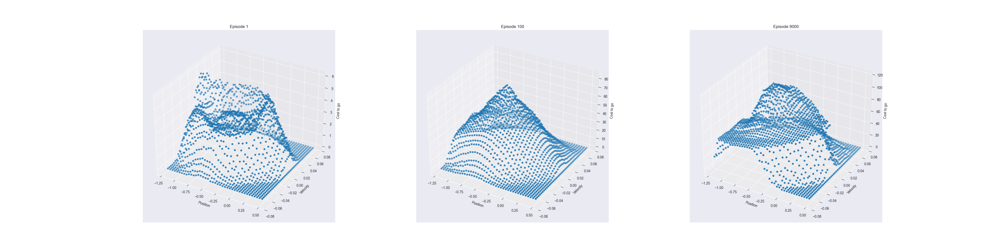
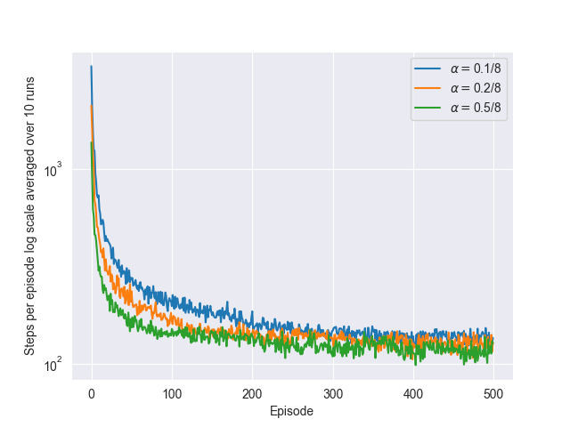
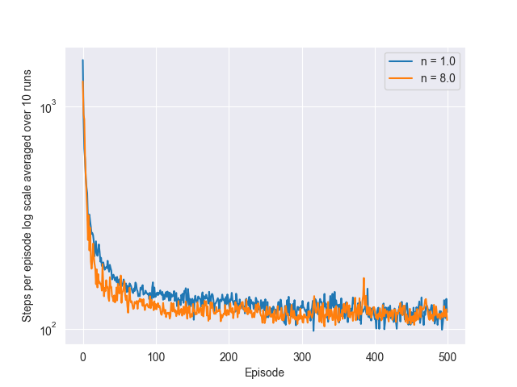
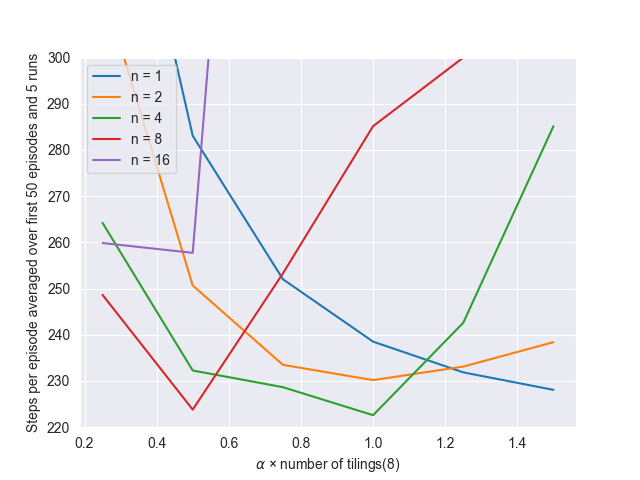

# **Mountain Car — Tile Coding & Semi-Gradient n-Step SARSA**

This project solves the classic **Mountain Car** control task with **tile-coded** linear function approximation and **semi-gradient n-step SARSA**. We reproduce the key findings from *Sutton & Barto* (Ch. 10): the choice of $n$ and step size (scaled by the number of tilings) strongly affects learning speed; tile coding yields a smooth cost-to-go surface that improves steadily over episodes.

---

## **Environment**

| Component | Details                                                                          |
| --------- | -------------------------------------------------------------------------------- |
| State     | Continuous $(\text{position}, \text{velocity})$                                  |
| Position  | $[-1.2,\ 0.5]$                                                                   |
| Velocity  | $[-0.07,\ 0.07]$                                                                 |
| Actions   | ${-1,,0,,1}$ (reverse, coast, forward)                                           |
| Dynamics  | $v' = v + 0.001,a - 0.0025\cos(3p)$; clipped to bounds; if $p'=-1.2$ then $v'=0$ |
| Reward    | $-1$ per time step until $p \ge 0.5$ (terminal)                                  |
| Discount  | $\gamma = 1.0$ (episodic)                                                        |

---

## **Function Approximation (Tile Coding)**

We approximate action-values with a **linear** function over sparse, binary features from multiple **tilings**:

* **Features:** indices of active tiles for $(p, v, a)$ across `num_of_tilings` overlapping grids.
* **Estimate:** $\hat q(p,v,a) ;=; \sum_{i \in \mathcal{A}(p,v,a)} w_i$.
* **Update:** semi-gradient TD on the active tiles.

The implementation uses Sutton’s **IHT** hash table and `tiles(...)` utility to map $(p,v,a)$ to tile indices (external collisions handled by IHT). 

---

## **Algorithm — Semi-Gradient $n$-Step SARSA**

For an episode generating $(S_t,A_t,R_{t+1})$, with $n!\ge!1$:

* **n-step return**
$
  G_{t:t+n} ;=; \sum_{k=1}^{n} \gamma^{k-1} R_{t+k} ;+; \gamma^n \hat q(S_{t+n},A_{t+n})
$
  (omit the bootstrap term if the episode ended before $t+n$).

* **Weight update (for each active tile $i$ in $S_t,A_t$)**
$
  w_i ;\leftarrow; w_i ;+; \alpha\Big(G_{t:t+n}-\hat q(S_t,A_t)\Big)
$

We use **optimistic initialization** of weights and set $\varepsilon=0$ (pure greedy) because optimism drives adequate exploration in Mountain Car. Action selection is greedy over current $\hat q$. All details (bounds, step dynamics, value function wrapper, action selection, and SARSA($n$) loop) are in the code. 

---

## **Parameters**

| Parameter           | Typical choices / notes                                       |
| ------------------- | ------------------------------------------------------------- |
| Tilings             | 8 (standard)                                                  |
| IHT size            | 2048 (hash table capacity)                                    |
| Step size           | Tune $\alpha \times$ `num_of_tilings` (e.g., $0.5, 1.0, 1.5$) |
| $n$ (SARSA horizon) | ${1,2,4,8,16}$                                                |
| Episodes per run    | 500–1000                                                      |
| Runs (averaging)    | 5–10                                                          |
| Exploration         | $\varepsilon=0$ with optimistic initial values                |

---

## **Results & Insights**

### **1) Steps vs. $\alpha \times$ tilings for different $n$**

* There is a **U-shaped** sensitivity to step size; too small learns slowly, too large destabilizes.
* **Moderate $n$ (≈4–8)** often achieves the **fewest steps per episode** early on.

### **2) Learning curves: $n=1$ vs $n=8$ (log-scale)**

* Both improve rapidly in the first ~50 episodes; **$n=8$** is slightly better on average once tuned.

### **3) Learning curves across step sizes**

* Properly scaling $\alpha$ by the number of tilings yields **stable, steady decrease** in steps/episode.

### **4) Cost-to-go surface over training**

* The learned **cost-to-go** (negative max $\hat q$) surface becomes smoother and higher near the **valley walls**, reflecting correct shaping for momentum building.

---

## **Implementation Details**

* **`mountain_car.py`**
  Environment bounds, physics update, greedy action selection with optimistic initialization, **tile-coded** `ValueFunction`, and the **semi-gradient n-step SARSA** training loop (plus cost-to-go visualization). 

* **`tile_coding.py`**
  Sutton’s **IHT** class and `tiles(...)` mapper used to generate active tile indices for $(p,v,a)$. 

* **Notebook**
  `mountain_car.ipynb` runs sweeps over $n$ and $\alpha$, logs steps/episode, and renders all four figures.

---

## **Project Structure**

| File / Notebook      | Description                                                 |
| -------------------- | ----------------------------------------------------------- |
| `mountain_car.py`    | Env, tile-coded value function, semi-gradient SARSA($n$).   |
| `tile_coding.py`     | IHT + tile indexing utilities.                              |
| `mountain_car.ipynb` | Experiments (sweeps, learning curves, cost-to-go surfaces). |
| `generated_images/`  | `figure_10_1.png` … `figure_10_4.png`.                      |

---

## **Conclusions**

* **Tile coding** provides a compact, generalizing representation that learns a sensible cost-to-go over the continuous state space.
* **$n$-step SARSA** with a well-tuned $\alpha \times$ tilings achieves strong performance; **intermediate $n$** is often best.
* **Optimistic initialization** allows greedy action selection without explicit $\varepsilon$-exploration in Mountain Car.

---

## **References**

* Sutton, R. S., & Barto, A. G. *Reinforcement Learning: An Introduction*, 2nd ed., Ch. 10 (On-policy control with approximation; Mountain Car).
