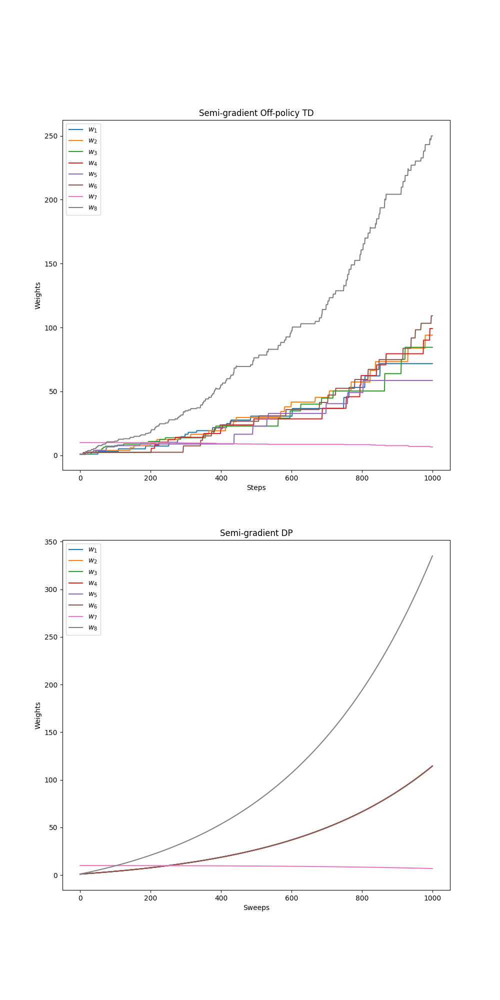
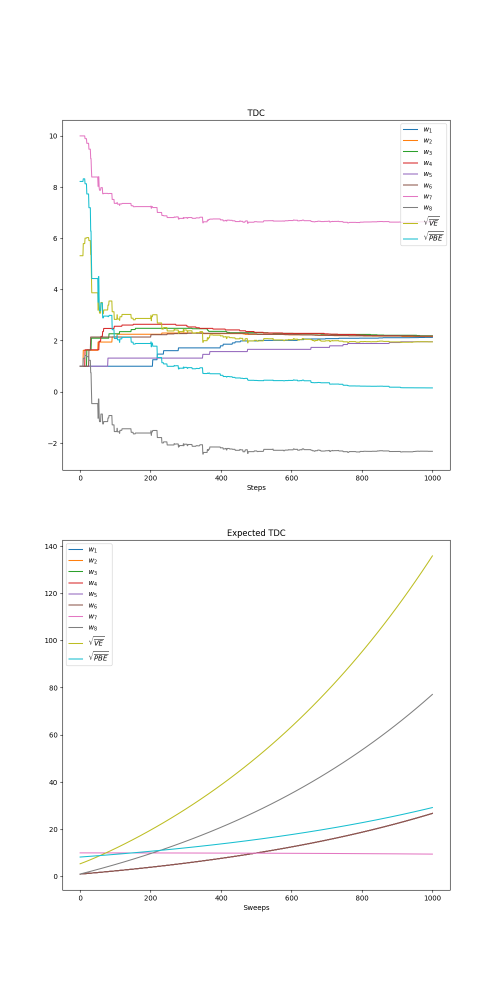
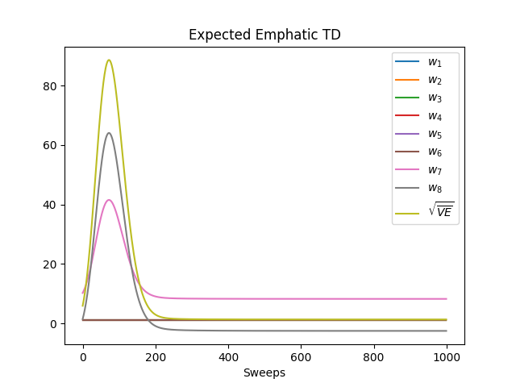

# **Off-Policy Prediction with Function Approximation — Baird’s Counterexample, Gradient-TD, and Emphatic TD**

This project reproduces core phenomena from *Sutton & Barto* (Ch. 11): the classic **Baird’s counterexample** where **semi-gradient off-policy TD** diverges, and the stability of **Gradient-TD** (TDC / GTD(0)) and **Emphatic TD** (ETD). We show parameter trajectories, projected-error metrics, and expected-update variants on the same example.

---

## **Environment (Baird’s Counterexample)**

| Component           | Details                                                                                                                  |
| ------------------- | ------------------------------------------------------------------------------------------------------------------------ |
| **States**          | 7 total: 6 “upper” states and 1 “lower” state                                                                            |
| **Actions**         | “dashed” and “solid”                                                                                                     |
| **Dynamics**        | From any state: **solid $\to$ lower** deterministically; **dashed $\to$ one of the 6 uppers** uniformly                  |
| **Rewards**         | Always $0$                                                                                                               |
| **Discount**        | $\gamma = 0.99$                                                                                                          |
| **Behavior policy** | Chooses **solid** with prob. $1/7$, **dashed** with prob. $6/7$ (off-policy)                                             |
| **Target policy**   | Always **solid**                                                                                                         |
| **Features**        | Linear FA with $d=8$; for upper states $x_i(s)=2$ and $x_8(s)=1$; for the lower state $x_7(s)=1$, $x_8(s)=2$; others $0$ |

The exact feature construction, policies, and helper routines are encoded in `counter_example.py`. 

---

## **Algorithms**

### 1) Semi-gradient Off-Policy TD

For linear value function $\hat v(s)=\mathbf{w}^{!\top} \mathbf{x}(s)$,
$
\delta_t ;=; r_{t+1}+\gamma,\mathbf{w}^{!\top}\mathbf{x}(s_{t+1})
-\mathbf{w}^{!\top}\mathbf{x}(s_t),\qquad
\rho_t ;=; \frac{\pi(a_t\mid s_t)}{\mu(a_t\mid s_t)},
$
$
\mathbf{w} \leftarrow \mathbf{w} + \alpha,\rho_t,\delta_t,\mathbf{x}(s_t).
$
On Baird’s MDP this **diverges** off-policy.

2) Gradient-TD (TDC / GTD(0))

This algorithm uses a dual set of weights, $\mathbf{w}$ for the value function and auxiliary weights $\mathbf{v}$ for the gradient correction.

TD Error:

$$\delta_t = R_{t+1} + \gamma \mathbf{w}^\top \mathbf{x}(s_{t+1}) - \mathbf{w}^\top \mathbf{x}(s_t)$$

Weight Updates (Sampling Form):

$$\mathbf{w} \leftarrow \mathbf{w} + \alpha \rho_t \left[ \delta_t \mathbf{x}(s_t) - \gamma \mathbf{x}(s_{t+1}) \left(\mathbf{x}(s_t)^\top \mathbf{v}\right) \right]$$

$$\mathbf{v} \leftarrow \mathbf{v} + \beta \rho_t \left[ \delta_t - \mathbf{x}(s_t)^\top \mathbf{v} \right] \mathbf{x}(s_t)$$

The auxiliary weights $\mathbf{v}$ are updated using the standard TD error gradient $\left(\delta_t - \mathbf{x}(s_t)^\top \mathbf{v}\right) \mathbf{x}(s_t)$, while the primary weights $\mathbf{w}$ incorporate the $\mathbf{v}$-dependent correction term $-\gamma \mathbf{x}(s_{t+1}) \left(\mathbf{x}(s_t)^\top \mathbf{v}\right)$ to target the true Mean Squared Bellman Error gradient.

3) Emphatic TD (Expected ETD)

This algorithm tracks an emphasis $M_t$ to ensure stability during off-policy learning. We use $i(s) \equiv 1$ for the interest function.

Emphasis Tracking:

$$M_{t+1} = \gamma \rho_t M_t + i(s_{t+1})$$

Weight Update (Sampling Form):

$$\mathbf{w} \leftarrow \mathbf{w} + \alpha \underbrace{M_t \rho_t}_{\text{emphatic weight}} \delta_t \mathbf{x}(s_t)$$

The update provided in your original request appears to be slightly mixed. A standard sampling ETD(0) update uses $M_t$ or $M_{t+1}$ depending on the specific convention, but the $\rho_t$ is typically applied to the TD error component.

Synchronous Expected ETD(0) Variant

For the synchronous expected-update version (often used in batch settings):

$$\mathbf{w} \leftarrow \mathbf{w} + \alpha \sum_{s \in \mathcal{S}} \mu(s) \left[ M(s) \rho(s) \mathbb{E}[\delta | s] \mathbf{x}(s) \right]$$

$M(s)$ is the emphasis for state $s$.

$\rho(s)$ is the expected importance sampling ratio $\mathbb{E}_{A \sim b(\cdot|s)}\left[\frac{\pi(A|s)}{b(A|s)}\right]$.

$\mathbb{E}[\delta | s]$ is the expected TD error given state $s$ under the behavior policy $b$.
---

## **Metrics**

* **$\sqrt{\text{VE}}$**: root mean value error under the behavior’s state distribution $\mu$.
* **$\sqrt{\text{PBE}}$**: root mean **projected Bellman error** w.r.t. the $\mu$-weighted projection onto the feature space.

Projection matrix $\Pi$ and metric computation follow the textbook definitions and are implemented in code. 

---

## **Parameters**

|                   Parameter | Typical                                         |
| --------------------------: | ----------------------------------------------- |
| $\alpha$ (TDC $\mathbf{w}$) | $10^{-3}$ to $10^{-2}$                          |
|  $\beta$ (TDC $\mathbf{v}$) | smaller than $\alpha$ (e.g., $\beta=\alpha/10$) |
|              $\alpha$ (ETD) | $10^{-3}$ to $10^{-2}$                          |
|              Sweeps / steps | 1,000 (figures show trajectories over time)     |
|                        Runs | 1–10 (expected variants are deterministic)      |

---

## **Results & Insights**

### **Semi-gradient off-policy TD diverges**

* **Top:** Semi-gradient off-policy TD shows **weight explosion**; no stable fixed point.
* **Bottom:** Semi-gradient DP (expected update without importance sampling) also grows on this construction.

### **Gradient-TD (TDC) stabilizes PBE, but expected TDC can drift**

* **TDC (sampling)**: weights settle; **$\sqrt{\text{PBE}}$** decreases and stabilizes.
* **Expected TDC** on this setup illustrates growth in $\sqrt{\text{VE}}$/**PBE** under certain step-size choices—highlighting sensitivity of expected-update variants.

### **Expected Emphatic TD converges**

* ETD’s emphatic weighting corrects the distribution mismatch and **converges**; **$\sqrt{\text{VE}}$** drops rapidly and plateaus.

---

## **Implementation Details**

* **`counter_example.py`**:
  Baird environment (states, actions, behavior/target policies), linear features ($d=8$), helpers for **RMSVE/RMSPBE**, and implementations of **Semi-gradient Off-policy TD**, **Semi-gradient DP**, **TDC (sampling & expected)**, and **Expected ETD**. 

* **Notebooks**:
  `bairds_counterexample.ipynb` (semi-gradient TD divergence),
  `tdc_baird.ipynb` (TDC sampling vs expected),
  `emphatic_baird.ipynb` (Expected ETD trajectories).

* **Figures**:
  `figure_11_2.png`, `figure_11_5.png`, `figure_11_6.png`.

---

## **Project Structure**

| File / Notebook               | Description                                                                    |
| ----------------------------- | ------------------------------------------------------------------------------ |
| `counter_example.py`          | Environment, features, metrics, and algorithm implementations (TD, TDC, ETD).  |
| `bairds_counterexample.ipynb` | Semi-gradient off-policy TD divergence demos and DP comparison.                |
| `tdc_baird.ipynb`             | TDC (sampling) vs **expected** TDC; weight and error curves.                   |
| `emphatic_baird.ipynb`        | Expected ETD stability; emphasis evolution and $\sqrt{\text{VE}}$.             |
| `generated_images/`           | Exported figures (`figure_11_2.png`, `figure_11_5.png`, `figure_11_6.png`).    |

---

## **Conclusions**

* **Semi-gradient off-policy TD** can **diverge** with linear function approximation under distribution mismatch (Baird).
* **Gradient-TD methods (TDC/GTD)** provide **stable off-policy** learning by following true gradients of the projected objective.
* **Emphatic TD** uses **emphasis weights** to correct for the behavior–target mismatch and **converges** on the counterexample.
* Expected-update variants can be informative but may be **step-size sensitive**; sampled updates are generally safer.

---

## **References**

* Sutton, R. S., & Barto, A. G. *Reinforcement Learning: An Introduction*, 2nd ed., Ch. 11 (Off-policy prediction; Gradient-TD; Emphatic TD).
* Baird, L. (1995). *Residual Algorithms: Reinforcement Learning with Function Approximation*. ICML.
