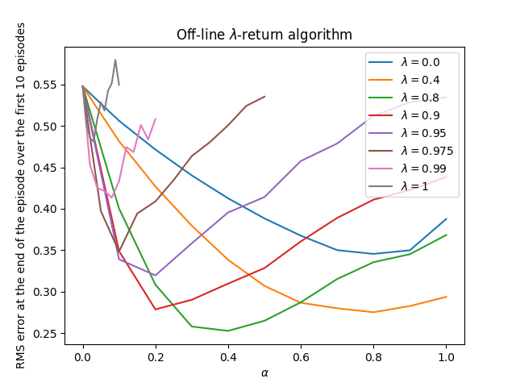
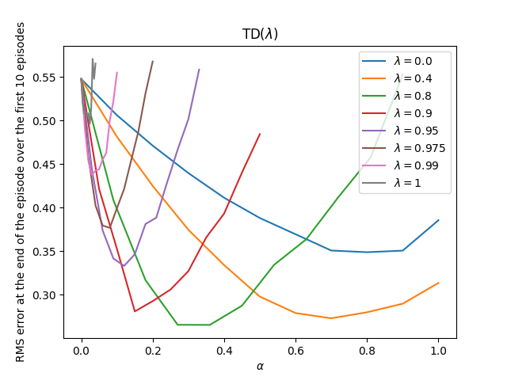
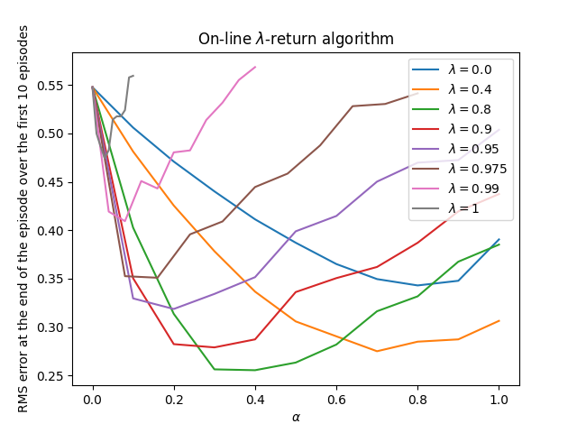

# **Eligibility Traces in Random Walk — TD($\lambda$), Off-line/On-line $\lambda$-Return**

This project explores **eligibility traces** for value prediction in the classic **19-state random walk**. We implement and compare three algorithms from *Sutton & Barto* (Ch. 12):

1. **Off-line $\lambda$-return**,
2. **TD($\lambda$)** with accumulating traces,
3. **On-line $\lambda$-return (True-online TD($\lambda$))**.

We study how $\lambda$ and $\alpha$ affect learning speed and accuracy (RMS error).

---

## **Environment**

| Component       | Details                                                                              |
| --------------- | ------------------------------------------------------------------------------------ |
| **States**      | Line of **21** states: terminals at $0$ and $20$; non-terminals $1\dots19$           |
| **Start**       | State **10**                                                                         |
| **Transitions** | At each step move **left/right** with probability $0.5$                              |
| **Rewards**     | $-1$ on entering state $0$, $+1$ on entering $20$, otherwise $0$                     |
| **Discount**    | $\gamma = 1.0$ (episodic, undiscounted)                                              |
| **True $V$**    | Analytic line used for RMSE: $V(i)=\tfrac{i-10}{10}$ for $i=1\dots19$; terminals $0$ |

---

## **Algorithms**

### 1) Off-line $\lambda$-return

Compute the $\lambda$-return after the episode and update once per visited state:
$$
G^{\lambda}*t ;=; (1-\lambda)\sum*{n=1}^{T-t-1}\lambda^{,n-1} G_{t:t+n}
;+; \lambda^{,T-t-1},G_{t:T},\qquad
V(S_t)\leftarrow V(S_t)+\alpha\big(G^{\lambda}_t-\hat V(S_t)\big).
$$

### 2) TD($\lambda$) with accumulating traces

Online updates each step using eligibility vector $z$:
$$
z \leftarrow \lambda z + \mathbf{1}*{S_t},\qquad
\delta_t = R*{t+1} + \hat V(S_{t+1}) - \hat V(S_t),\qquad
\mathbf{w} \leftarrow \mathbf{w} + \alpha,\delta_t, z.
$$

### 3) On-line $\lambda$-return (True-online TD($\lambda$))

Bias-corrected Dutch traces that match the forward view for any $\alpha$:

* Dutch-trace update $z \leftarrow \lambda z + \mathbf{1}*{S_t} - \alpha\lambda, z*{S_t}\mathbf{e}_{S_t}$,
* Weight correction that depends on the previous and current state values.

(All three are implemented with **state aggregation** where each state is its own feature.)

---

## **Parameters**

|             Parameter | Typical values / sweeps                        |
| --------------------: | ---------------------------------------------- |
|    Step size $\alpha$ | $[0.05,,1.0]$ (grid per method)                |
| Trace-decay $\lambda$ | ${0.0,,0.4,,0.8,,0.9,,0.95,,0.975,,0.99,,1.0}$ |
|  Episodes / averaging | First **10** episodes, averaged over many runs |
|                Metric | **RMS error** at episode end vs $\alpha$       |

---

## **Results & Insights**

### Off-line $\lambda$-return

* Clear **U-shapes** vs $\alpha$.
* **Intermediate $\lambda$ (≈ 0.8)** tends to achieve the **lowest RMS** in this task.

### TD($\lambda$)

* Similar trends, but stability range depends more strongly on $\alpha$.
* **$\lambda\in[0.7,0.9]$** often offers the best bias–variance trade-off.

### On-line $\lambda$-return (True-online TD($\lambda$))

* Matches the forward view **online** and typically maintains good performance across a **wider** $\alpha$ range.
* Again, **mid-range $\lambda$** performs best early in learning.

**Takeaways.**

* **Eligibility traces help**: moving from TD(0) towards moderate $\lambda$ reduces early-episode error.
* **Too large $\lambda$ ($\approx1$)** becomes more Monte-Carlo-like—lower asymptotic bias but **higher variance** and narrower stable $\alpha$.

---

## **Implementation Details**

* **Core file:** `random_walk.py`

  * Environment dynamics and true-value construction.
  * Classes: `OffLineLambdaReturn`, `TemporalDifferenceLambda` (TD($\lambda$)), `OnLineLambdaReturn` (true-online).
  * Utilities for **parameter sweeps** and **RMS** aggregation.
* **Notebook:** `random_walk.ipynb`

  * Sweeps over $\lambda$ and $\alpha$, reproduces the three figures.

---

## **Project Structure**

| File / Notebook     | Description                                                                                   |
| ------------------- | --------------------------------------------------------------------------------------------- |
| `random_walk.py`    | Env, algorithm implementations, and sweep/plot helpers.                                       |
| `random_walk.ipynb` | Driver notebook to generate RMS-vs-$\alpha$ curves for all three methods.                     |
| `generated_images/` | `figure_12_3.png` (Off-line), `figure_12_6.png` (TD($\lambda$)), `figure_12_8.png` (On-line). |

---

## **Conclusions**

* **Intermediate $\lambda$ (≈ 0.8)** generally minimizes early **RMS error** in the random-walk prediction task.
* **TD($\lambda$)** benefits from traces but requires careful **step-size** tuning.
* **True-online TD($\lambda$)** achieves the forward-view target **online**, offering strong accuracy with robust stability across $\alpha$.

---

## **References**

* Sutton, R. S., & Barto, A. G. *Reinforcement Learning: An Introduction*, 2nd ed., Ch. 12 (Eligibility traces; TD($\lambda$); true-online TD($\lambda$)).
