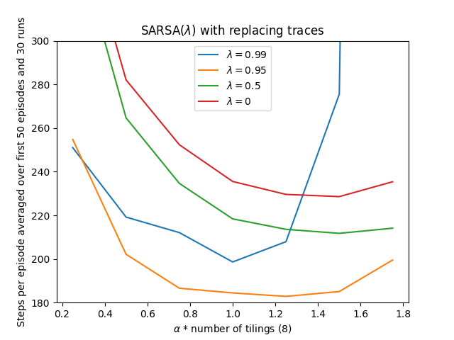
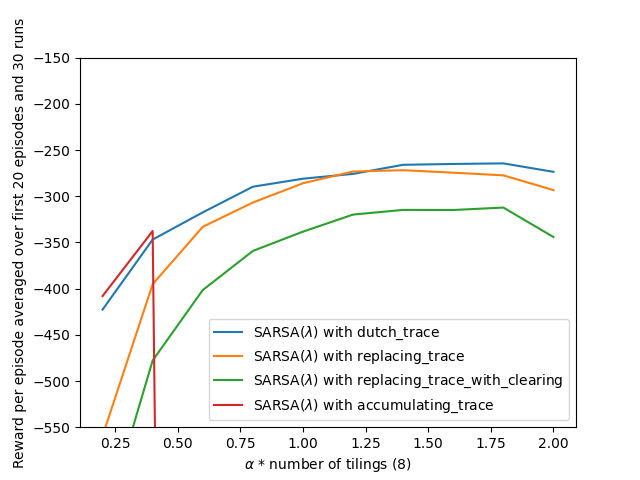

# **Mountain Car — SARSA($\lambda$) with Tile Coding & Eligibility Traces**

This project implements **SARSA($\lambda$)** for the classic **Mountain Car** control task using **tile coding** for function approximation and several **eligibility-trace** variants. We reproduce the Chapter 12 experiments from Sutton & Barto comparing trace types and step-size choices.

---

## **Environment**

| Component       | Details                                                                  |
| --------------- | ------------------------------------------------------------------------ |
| **State**       | Continuous $(\text{position}, \text{velocity})$                          |
| **Actions**     | ${-1, 0, +1}$ (reverse, coast, forward)                                  |
| **Dynamics**    | Standard Mountain Car physics with velocity clipping and left-wall reset |
| **Reward**      | $-1$ per step until reaching the goal position                           |
| **Episode cap** | Up to 5000 steps (runs terminate on goal or cap)                         |
| **Discount**    | $\gamma = 1.0$ (episodic)                                                |

---

## **Function Approximation (Tile Coding)**

We approximate $Q(s,a)$ with **tile coding**: multiple offset tilings over the $(x,\dot x)$ space; one tile per tiling is active and their weights sum to produce the estimate.
Key knobs: number of tilings, hash table size, and step-size scaling by tilings.

---

## **Algorithms**

### **SARSA($\lambda$) with traces**

For transition $(s_t,a_t,r_{t+1},s_{t+1},a_{t+1})$,

* **TD target:** $r_{t+1} + \gamma, \hat Q(s_{t+1},a_{t+1})$
* **TD error:** $\delta_t = \text{target} - \hat Q(s_t,a_t)$
* **Trace update:** one of the following

  * **Accumulating:** $z \leftarrow \gamma\lambda z;; z_i \leftarrow z_i + \mathbb{1}[i \in \text{active}]$
  * **Dutch trace:** $z \leftarrow \gamma\lambda z;; z_{\text{active}} \mathrel{+}= 1 - \alpha\gamma\lambda \sum_{i\in \text{active}} z_i$
  * **Replacing:** set active components to $1$; decay others by $\gamma\lambda$
  * **Replacing w/ clearing (control):** like replacing, but zero traces for tiles of non-selected actions
* **Weight update:** $w \leftarrow w + \alpha,\delta_t, z$

Action selection is **greedy** here (optimistic initialization removes the need for $\epsilon$-exploration); you can flip to $\epsilon$-greedy if desired.

---

## **Parameters**

| Parameter                 | Typical values / notes                     |
| ------------------------- | ------------------------------------------ |
| Step size $\alpha$        | Swept; shown as $\alpha \times$ (#tilings) |
| Trace parameter $\lambda$ | ${0,,0.5,,0.95,,0.99}$                     |
| # of tilings              | 8 (as in the textbook figures)             |
| Hash table size           | 2048 (sufficient for these runs)           |
| Episodes per run          | 500 (learning curves)                      |
| Runs (averaging)          | 20–30                                      |

---

## **Results & Insights**

### 1) **Sensitivity to $\alpha$ and $\lambda$ (Replacing Traces)**

* Best region is around **$\lambda \approx 0.95$** and **$\alpha\times 8 \in [1.0, 1.4]$**, achieving the **fewest steps per episode** in the first 50 episodes.
* $\lambda=0$ (no traces) learns slower; very large $\lambda$ ($0.99$) can become unstable at higher $\alpha$.

### 2) **Trace Type Comparison (Performance after 20 Episodes)**

* **Dutch traces** and **replacing traces** give the **strongest improvement** once $\alpha$ is tuned.
* **Replacing + clearing** is safer for control (prevents cross-action contamination) but may need a bit more data.
* **Accumulating traces** can be brittle at larger $\alpha$ due to rapid trace growth.

---

## **Implementation Details**

* **`mountain_car.py`** — environment dynamics, SARSA($\lambda$) agent with the four trace update rules, cost-to-go visualization, and experiment drivers.
* **`tile_coding.py`** — Sutton’s tile-coding utilities (IHT hash table, `tiles(...)` mapper).
* **`mountain_car.ipynb`** — notebooks to reproduce the two figures, sweep $\alpha$ and $\lambda$, and compare trace types.

---

## **Project Structure**

| File / Notebook      | Description                                                                  |
| -------------------- | ---------------------------------------------------------------------------- |
| `mountain_car.py`    | SARSA($\lambda$) with accumulating / dutch / replacing / replacing+clearing. |
| `tile_coding.py`     | Tile coding helper classes and functions.                                    |
| `mountain_car.ipynb` | Experiments, sweeps, and figure generation.                                  |
| `generated_images/`  | `figure_12_10.png`, `figure_12_11.png`.                                      |

---

## **How to Reproduce**

1. Pick a trace type and set $(\alpha,\lambda)$.
2. Run multiple seeds; log **steps per episode** (lower is better) or **return per episode** (less negative is better).
3. For curves like above:

   * Sweep $\alpha\times 8$ in ${0.25, 0.5, \dots, 2.0}$ for each $\lambda$.
   * Average over $20$–$30$ runs.
   * Plot either steps-per-episode (first 50 episodes) or reward-per-episode (first 20).

---

## **Conclusions**

* **Eligibility traces** substantially accelerate learning in Mountain Car; **$\lambda\in[0.8,0.99]$** is typically beneficial.
* **Trace type matters**: **Dutch** and **replacing** traces are robust and high-performing for this control task.
* Proper **step-size scaling by the number of tilings** and **optimistic initialization** yield stable, fast convergence.

---

## **References**

* Sutton, R. S., & Barto, A. G. *Reinforcement Learning: An Introduction*, 2nd ed., Ch. 12 (Eligibility traces; tile coding; Mountain Car).
