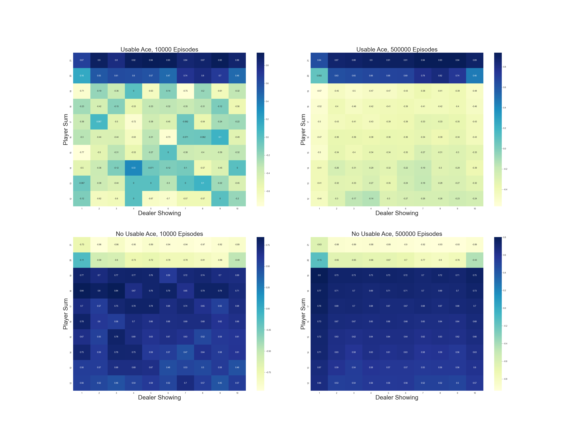
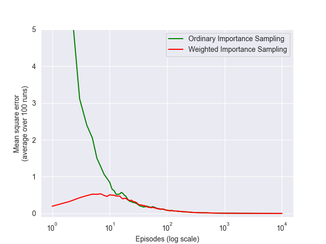
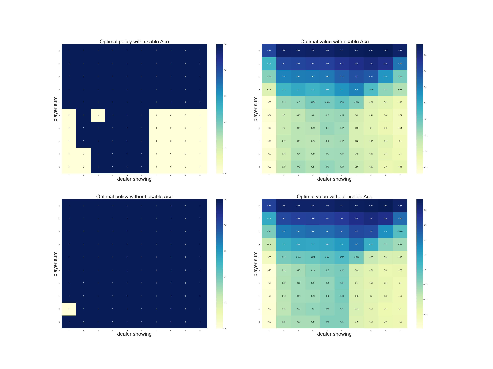

# Monte Carlo Methods in Blackjack

This project implements a simplified version of the game **Blackjack** to explore **Monte Carlo methods** in reinforcement learning. It demonstrates three approaches—**on-policy**, **off-policy**, and **exploring starts**—to estimate state and action values in a stochastic environment.

The implementation is heavily inspired by examples from Sutton and Barto’s *"Reinforcement Learning: An Introduction"*, adapted into a practical, interactive simulation.

---

## Key Components

| Component                | Description                                                                 |
|--------------------------|-----------------------------------------------------------------------------|
| **Environment**          | A simplified Blackjack game with rules mimicking the standard casino version. |
| **Player Policy**        | On-policy and off-policy versions. Target policy sticks at 20+, otherwise hits. |
| **Dealer Policy**        | Sticks on 17 or higher, hits otherwise.                                     |
| **Monte Carlo Methods**  | Includes On-policy, Off-policy with importance sampling, and Exploring Starts. |
| **Evaluation Metrics**   | Average return estimates and action-value functions, optionally visualized. |

---

## Theoretical Background and Implications

### 1. **On-Policy Monte Carlo**

Estimates the value of states under a fixed target policy by averaging returns over many episodes.

### 2. **Off-Policy Monte Carlo with Importance Sampling**

Uses trajectories from a **behavior policy** to estimate returns for a **target policy**. Key idea:

$$
V^{\pi}(s) \approx \frac{1}{n} \sum_{i=1}^n \rho_i G_i
$$

Where:

- $G_i$ is the return from episode $i$,
- $\rho_i = \prod_t \frac{\pi(a_t|s_t)}{b(a_t|s_t)}$ is the importance sampling ratio.

Two variants:

- **Ordinary**: Averages $\rho_i G_i$ directly.
- **Weighted**: Normalizes by the cumulative sum of $\rho_i$ to reduce variance.

### 3. **Monte Carlo with Exploring Starts (ES)**

Estimates optimal state-action values by starting episodes from random state-action pairs and improving the policy greedily.

---


## Results & Insights

### Figure 1: Average State Value – On-Policy (Usable Ace)

  

---

### Figure 2: Importance Sampling – Off-Policy Estimates

  


---

### Figure 3: Exploring Starts – Optimal Policy Learning

  

---

### Summary of Observations

- **Off-Policy Sampling**: Demonstrates how importance sampling can produce unbiased estimates, but with potential for **high variance**—especially in the ordinary version.
- **Exploring Starts**: Encourages full exploration of state-action space and gradually **converges to an optimal policy** using greedy improvements.
- **On-Policy Evaluation**: Provides a **reliable baseline** for evaluating policies under fixed behavior.

These visualizations from the notebook highlight:

- The impact of having a **usable ace** on expected returns.
- **Stability vs accuracy** trade-offs in sampling strategies.
- How optimal policies can emerge from random exploration.

---
## Project Structure

### 1. `black_jack.py`

Main simulation logic and Monte Carlo methods:

- `play()`: Simulates a single game episode.
- `monte_carlo_on_policy()`: Evaluates value functions using the target policy.
- `monte_carlo_off_policy()`: Uses importance sampling for off-policy evaluation.
- `monte_carlo_es()`: Learns optimal policy via Exploring Starts.

### 2. `black_jack.ipynb`

Jupyter Notebook for analysis and visualization:

- Runs simulations with different sampling methods.
- Visualizes value estimates using surface plots.
- Compares performance and convergence trends of various Monte Carlo strategies.

---

## How to Run

1. **Install dependencies**
   ```bash
   pip install numpy tqdm matplotlib
   ```

2. **Run the notebook**
   ```bash
   jupyter notebook black_jack.ipynb
   ```

3. **Explore results**
   - Adjust the number of episodes for faster or deeper training.
   - Modify policies or reward logic to experiment with learning behavior.
