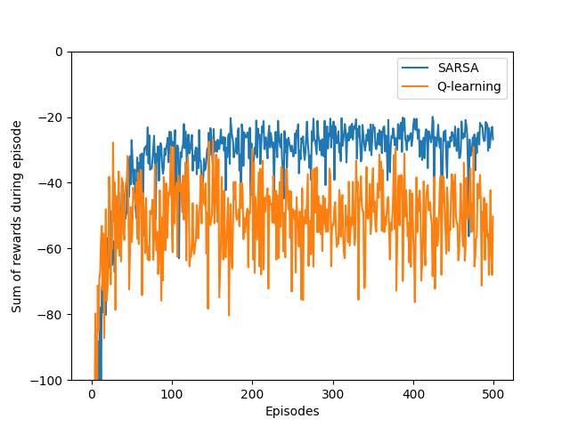
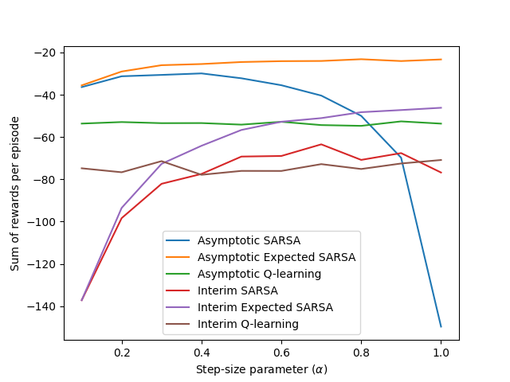

# SARSA, Expected SARSA, and Q-Learning in the Cliff Walking Task

This project implements **model-free reinforcement learning algorithms** (SARSA, Expected SARSA, and Q-Learning) in the classic **Cliff Walking** environment described in *Reinforcement Learning: An Introduction* by Sutton and Barto. The aim is to explore how different learning strategies behave under the same environment conditions and compare their performances based on cumulative reward and learned policy.

## Key Components

**Environment Specifications:**
- Grid size: 4 rows × 12 columns
- Start state: (3, 0)
- Goal state: (3, 11)
- Cliff: states between (3,1) and (3,10), stepping into which gives a reward of -100 and returns the agent to the start
- All other steps yield a reward of -1

**Parameters:**

| Parameter               | Value   |
|------------------------|---------|
| Discount factor ($\gamma$) | 1.0     |
| Exploration rate ($\epsilon$) | 0.1     |
| Learning rate ($\alpha$)     | 0.5     |
| Episodes              | 500     |

---

## Theoretical Background and Implications

Cliff Walking is a canonical example in **on-policy vs. off-policy** learning. The main objective is to estimate the optimal action-value function $Q^*(s, a)$, from which we derive the optimal policy $\pi^*(s) = \arg\max_a Q^*(s, a)$.

### On-policy SARSA
SARSA updates the Q-value based on the action actually taken by the current policy:

$$
Q(S_t, A_t) \leftarrow Q(S_t, A_t) + \alpha [R_{t+1} + \gamma Q(S_{t+1}, A_{t+1}) - Q(S_t, A_t)]
$$

### Expected SARSA
Expected SARSA is a variant of SARSA that uses the expected value of the next state’s Q-values instead of the value of the action actually taken:
$$
Q(S_t, A_t) \leftarrow Q(S_t, A_t) + \alpha \left[R_{t+1} + \gamma \sum_a \pi(a|S_{t+1}) Q(S_{t+1}, a) - Q(S_t, A_t)\right]
$$

### Q-Learning (Off-policy)
Q-Learning updates toward the maximum possible Q-value of the next state, regardless of the agent’s actual behavior:
$$
Q(S_t, A_t) \leftarrow Q(S_t, A_t) + \alpha [R_{t+1} + \gamma \max_a Q(S_{t+1}, a) - Q(S_t, A_t)]
$$

These algorithms differ fundamentally in **how they use their estimates**, which significantly affects their performance in environments with dangerous transitions, like the cliff.

---

## Algorithms Implemented

The following algorithms are implemented:

1. **SARSA**  
   - On-policy learning  
   - More conservative policy; avoids the cliff

2. **Expected SARSA**  
   - Expected value over all actions, weighted by $\epsilon$-greedy policy  
   - Smoother convergence

3. **Q-Learning**  
   - Off-policy; learns the optimal policy regardless of behavior  
   - Riskier, often cuts too close to the cliff

The agent follows an $\epsilon$-greedy policy:
- With probability $\epsilon$, a random action is selected.
- With probability $1 - \epsilon$, the best-known action is taken.

---

## Results and Insights

### Cumulative Reward per Episode

| Aspect                                    | SARSA                                     | Q-Learning                                 | Expected SARSA                           |
| ----------------------------------------- | ----------------------------------------- | ------------------------------------------ | ---------------------------------------- |
| **Exploration Safety**                    | Safer – avoids cliff during exploration   | Riskier – often falls off cliff early      | Safe and balanced                        |
| **Learning Behavior**                     | Learns a conservative, stable path        | Learns optimal path, risky during training | Balances between SARSA and Q-learning    |
| **Performance during Training**           | More consistent and stable                | High variance in early episodes            | Smooth performance across episodes       |
| **Convergence (as \$\epsilon \to 0\$)**   | Sub-optimal (safe path)                   | Optimal (shortest path)                    | Near-optimal with better stability       |
| **Sensitivity to Step-Size (\$\alpha\$)** | Moderate                                  | Moderate                                   | Robust across a wide range of \$\alpha\$ |
| **Recommended Use**                       | When safety and training stability matter | When final optimality is the priority      | For balanced, reliable learning dynamics |

### Performance Across Step-Sizes

A comparison across different step-size values ($\alpha$) reveals that Expected SARSA is more robust to parameter changes. Smaller $\alpha$ leads to slower but stable learning, while larger values accelerate convergence at the risk of instability.
