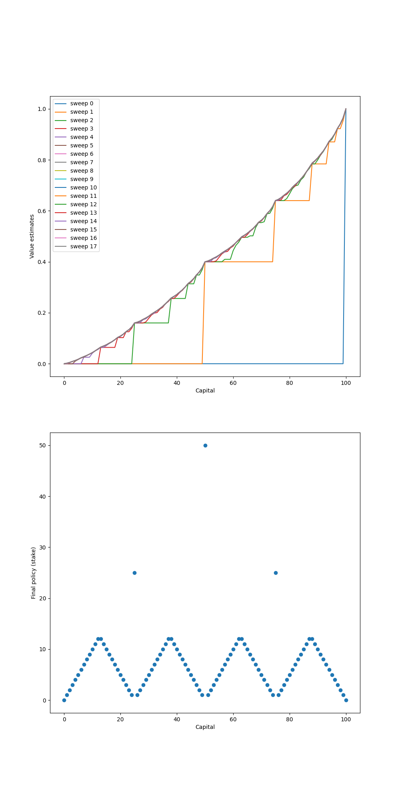

# Gambler's Problem – Value Iteration Approach

This project implements the **Gambler’s Problem** using the **Value Iteration** algorithm, based on the example and explanation in *Reinforcement Learning: An Introduction* by Sutton and Barto (Figure 4.3).

---

## Key Components

| Component                  | Description                                                                 |
|----------------------------|-----------------------------------------------------------------------------|
| **States**                 | Represent the gambler’s capital from 0 to 100.                              |
| **Actions**                | Possible stakes, bounded by the current capital and distance from the goal. |
| **Reward**                 | +1 only when reaching the goal; otherwise 0.                                |
| **Transition Probability** | Determined by the probability of the coin coming up heads (p_h = 0.4).     |
| **Terminal States**        | Capital of 0 (loss) and 100 (win).                                          |

---

## Algorithms Implemented

- **Value Iteration:**
  - Iteratively updates the state-value function until convergence.
  - Extracts the optimal policy based on the current value function.
- **Policy Extraction:**
  - For each state, chooses the action (stake) that maximizes the expected value.


---

## Results and Insights

The implementation visualizes:

1. **Value Function Over Sweeps:** How the estimated value of each state changes across iterations.
2. **Final Optimal Policy:** The stake chosen for each capital value under the optimal policy.



- **Top Plot:** Shows how value estimates evolve with each sweep of value iteration. The value function converges quickly for most states, especially near the goal.
- **Bottom Plot:** Shows the final policy (stake) for each capital. The spikes indicate the optimal bets, which are often either very small or very large. The result matches Figure 4.3 from Sutton’s book.


---

## **How to Run**  
1. Install dependencies

2. Run Jupyter notebook:  
   ```bash
   jupyter notebook gamblers_problem.ipynb
   ```
3. Generated plots are saved in `../generated_images/`.

