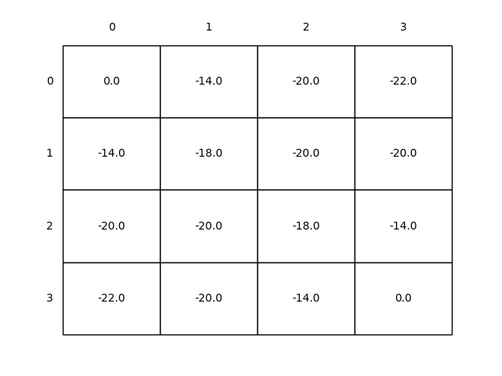
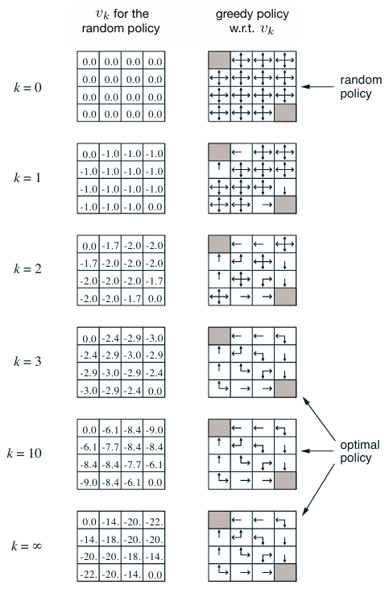

# **Dynamic Programming for MDPs in Gridworld**  
This project implements **Dynamic Programming (DP)** methods—specifically **iterative policy evaluation** and **policy improvement**—for solving a 4×4 gridworld MDP, following *Reinforcement Learning: An Introduction* (Sutton & Barto, Example 4.1). It demonstrates how DP algorithms converge to optimal value functions and policies in **finite MDPs** with discrete states and actions.

---

## **Key Components of the Gridworld**  
| Component          | Details                                                                 |
|--------------------|-------------------------------------------------------------------------|
| **State Space (S)** | 4×4 grid (16 states, indexed 1–14 + 2 terminal states at corners)      |
| **Terminal States** | - Shaded corners where the episode ends.<br>- All actions yield reward 0 (no further transitions). |
| **Actions (A)**    | {↑, ↓, ←, →} (deterministic transitions, except off-grid moves)        |
| **Reward Function**| −1 for all transitions until termination                               |
| **Policy (π)**     | Equiprobable random policy (π(a∣s) = 0.25 ∀a)                          |
| **Discount (γ)**   | 1.0 (undiscounted episodic task)                                       |

---

## **Algorithms Implemented**  
### **1. Iterative Policy Evaluation**  
Solves the **Bellman Expectation Equation** for a fixed policy π using in-place or out-of-place updates:  

%20=%20\begin{cases}%200%20&%20\text{if%20}s%20\text{%20is%20terminal}%20\\%20\sum_a%20\pi(a|s)%20\sum_{s'}%20p(s'|s,a)%20[r%20+%20\gamma%20v_\pi(s')]%20&%20\text{otherwise}%20\end{cases})  

- **Input**: Random policy, γ=1.0, threshold=1e-4.  
- **Output**: Converged value function (negation of expected steps to termination).  
- Value fixed at 0 for terminal states (no future rewards).


### **2. Policy Improvement**  
Derives a **greedy policy** π' from the evaluated value function:  
%20=%20\arg\max_a%20\sum_{s'}%20p(s'|s,a)%20[r%20+%20\gamma%20v_\pi(s')])  

π' is guaranteed to be better than or equal to π (per the Policy Improvement Theorem).  

---

## **Results & Insights**  
### **Policy Evaluation (Random Policy)**  
| In-Place Updates | Out-of-Place Updates |  
|------------------|----------------------|  
|  |  |  

- **Observations**:  
  - Values converge to **−expected steps to termination** (e.g., −14 for farthest state).  
  - In-place updates typically converge faster (fewer iterations) due to immediate feedback.  

### **Policy Improvement (Greedy Policy)**  
  
- **From Sutton & Barto**:  
  - Greedy policies derived from *vₖ* show optimal actions (right column).  
  - Arrows indicate multiple optimal actions in some states.  

---

## **Theoretical Implications**  
1. **Policy Evaluation**:  
   - Demonstrates solving a system of linear equations iteratively.  
   - Highlights trade-offs between in-place (memory-efficient) vs. out-of-place (stable) updates.  

2. **Policy Improvement**:  
   - Validates the **Policy Improvement Theorem**: *vₖ* guides better policy derivation.  
   - Optimal policies emerge even from random initialization (by iteration 3 in Example 4.1).  

3. **DP for MDPs**:  
   - Requires **full knowledge of the environment** (transition/reward models).  
   - Uses **bootstrapping** (updating estimates from other estimates).  

---

## **How to Run**  

1. **Run the Notebook**:  
   ```bash
   jupyter notebook notebooks/grid_word.ipynb
   ```  

2. **Generated Outputs**:  
   - Value function plots saved in `../generated_images/`.  
   - Compare `figure_4_1_in_place.png` (faster) vs. `figure_4_1_out_place.png` (stable).  

