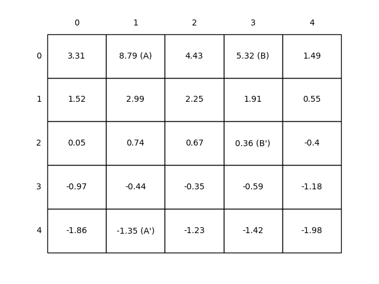
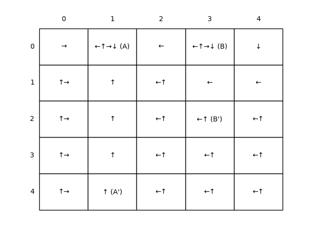

# **Markov Decision Process (MDP) in Grid-World**
This project implements **MDP solution methods** (policy evaluation and value iteration) for a 5×5 grid-world environment, following Sutton & Barto's *Reinforcement Learning: An Introduction*. It demonstrates how Bellman equations converge to optimal value functions and policies in a finite MDP with discrete states and actions.

---

## **Key Components of the MDP**  
| Component          | Implementation Details                              |
|--------------------|----------------------------------------------------|
| **State Space (S)** | 5×5 grid (25 discrete states)                     |
| **Action Space (A)** | {↑, ↓, ←, →}                                      |
| **Transition Model** | Deterministic (except edge collisions)            |
| **Reward Function** | Special states (A=+10, B=+5), edges=-1, else=0    |
| **Discount (γ)**    | 0.9                                               |

---

## **Algorithms Implemented**

### **1. Policy Evaluation**  
Solves the **Bellman Expectation Equation** for a fixed policy π:


%20=%20\sum_a%20\pi(a|s)%20\sum_{s'}%20p(s'|s,a)%20[r%20+%20\gamma%20v_\pi(s')])


- **Input**: Uniform random policy (π(a|s) = 0.25 ∀a)  
- **Output**: Converged value function (Figure 3.2) 
---

### **2. Value Iteration**  
- Solves the **Bellman Optimality Equation** by iteratively updating \( v(s) \) and improving the policy.
- At each iteration, the update rule is:

%20\leftarrow%20\max_a%20\sum_{s'}%20p(s'|s,a)%20[r%20+%20\gamma%20v(s')])

- Once \( v(s) \) converges, the optimal policy is derived as:

%20=%20\arg\max_a%20\sum_{s'}%20p(s'|s,a)%20[r%20+%20\gamma%20v_*(s')])

- **Output**: Optimal value function + policy (Figure 3.5)  

---

## **Results & MDP Insights**  
### **Policy Evaluation (Random Policy)**  
  
- **Key Observations**:  
  - States near edges have negative values due to high penalty probability.  
  - State A's value (8,79) < +10 due to transition to A' (vulnerable to edges).  
  - Demonstrates *policy evaluation* for a given π.  

### **Value Iteration (Optimal Policy)**  
  
- **Key Observations**:  
  - Arrows show *multiple optimal actions* in some states.  
  - State B's value > +5 due to strategic path through B'.  
  - Illustrates *policy improvement* via value iteration.  


---

## **Theoretical Implications**  
1. **MDP Fundamentals**:  
   - States, actions, rewards, and γ fully define the problem.  
   - Discount factor (γ=0.9) controls long-term vs. immediate rewards.  

2. **Bellman Equations**:  
   - Policy evaluation = iterative solution of linear equations.  
   - Value iteration = dynamic programming with max operator.  

3. **Optimality**:  
   - Optimal policy exists for finite MDPs (per Bellman’s principle).  

---

## **How to Run**  
1. Install dependencies

2. Run Jupyter notebook:  
   ```bash
   jupyter notebook grid_world.ipynb
   ```
3. Generated plots are saved in `../generated_images/`.

