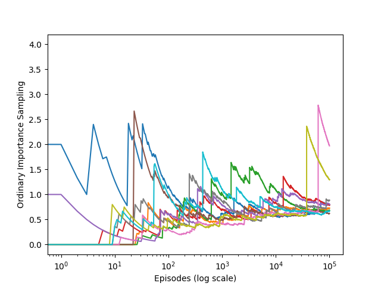

# Infinite Variance in Off-Policy Evaluation  
This project provides a minimal simulation to demonstrate a well-known theoretical problem in **off-policy evaluation**: the emergence of *infinite variance* when applying **importance sampling** under a policy mismatch. The example is modeled after Example 5.5 from *"Reinforcement Learning: An Introduction"* by Sutton and Barto.

---

## Key Components

| Component            | Description                                                                 |
|----------------------|-----------------------------------------------------------------------------|
| **Action Space**     | Two discrete actions: `left` and `right`.                                  |
| **Target Policy**    | Always selects the `left` action (deterministic).                          |
| **Behavior Policy**  | Selects `left` or `right` with equal probability (stochastic).             |
| **Environment**      | Episode continues with `left` actions and ends probabilistically. Choosing `right` ends the episode immediately with zero reward. |
| **Reward Structure** | A reward of 1 is received only if the agent selects only `left` and reaches the terminal state. |
| **Evaluation Method**| Importance sampling is used to estimate the expected return of the target policy using trajectories generated by the behavior policy. |

---

## Theoretical Background and Implications

Off-policy evaluation estimates the expected return of a **target policy** using data collected from a different **behavior policy**. A standard approach is **importance sampling**, which adjusts for the policy difference:

$$
V^{\pi} \approx \rho \cdot G = \left(\prod_{t=1}^T \frac{\pi(a_t | s_t)}{b(a_t | s_t)}\right) \cdot G
$$

Where:
- $G$ is the return,
- $\rho$ is the importance weight.

In this project:
- $\pi(\text{left}) = 1$, and 
- $b(\text{left}) = b(\text{right}) = 0.5$, so 
  $\rho = 2^n$ if `n` left actions occur.

This exponential growth causes:

$$
\text{Var}(V^{\pi}) \to \infty
$$

### Implications

Despite being unbiased, this estimator becomes impractical due to extreme variance. It highlights the need for variance-reduction methods such as:

- **Weighted importance sampling**:  

$$
\frac{\sum \rho_i G_i}{\sum \rho_i}
$$

- **Per-decision importance sampling**:

$$
\prod_{t=1}^k \frac{\pi(a_t|s_t)}{b(a_t|s_t)} \cdot R_t
$$

This simplified simulation illustrates why naive importance sampling is often unstable in real-world reinforcement learning settings.

---

## Results & Insights

The notebook runs the simulation across thousands of episodes to illustrate the statistical properties of importance sampling.

### Observations

- **Extreme Outliers**: A few episodes with large $\rho$ values dominate the estimate.
- **Exploding Variance**: The variance of the estimator grows significantly as more episodes are collected.
- **Unreliable Estimation**: Even though the estimator is unbiased, the instability makes it practically unusable.

### Example Output 

#### Importance Sampling Return Estimates

  


---

## Project Structure

### 1. `infinite_variance.py`

This module defines the simulation environment and policies.

- **Actions**: A binary action space `left = 0` and `right = 1`.
- **`target_policy()`**: Always returns `left` with probability 1. That is, \( \pi(left | s) = 1 \).
- **`behavior_policy()`**: Returns `left` or `right` with equal probability. That is, \( b(left | s) = 0.5 \).
- **`play()`**:
  - Simulates a single episode using the behavior policy.
  - Returns a reward of 1 if only `left` actions are chosen and the terminal state is reached (with probability 0.1 at each time step).
  - Returns 0 immediately if a `right` action is taken.
  - Outputs both the reward and the action trajectory, which are used to compute importance weights.

### 2. `infinite_variance.ipynb`

This Jupyter Notebook complements the simulation with empirical analysis:

- Executes multiple episodes via the `play()` function.
- Calculates cumulative importance weights and returns.
- Demonstrates through repeated trials how the variance in off-policy estimates grows or diverges.
- May include visualizations and statistical summaries to provide insight into the estimator's instability.

---


## How to Run
1. Install dependencies.
You can see the requirements in `requirements.txt`


2. Run the `ten_armed_testbed.ipynb` notebook:
   ```bash
   python ten_armed_testbed.ipynb
   ```
3. Generated plots are saved in `../generated_images/`.


---
The core objective is to show that although importance sampling is an unbiased method for evaluating the expected return of a target policy using data generated by a different behavior policy, it can suffer from catastrophic variance when the action probabilities under the target and behavior policies diverge significantly.


